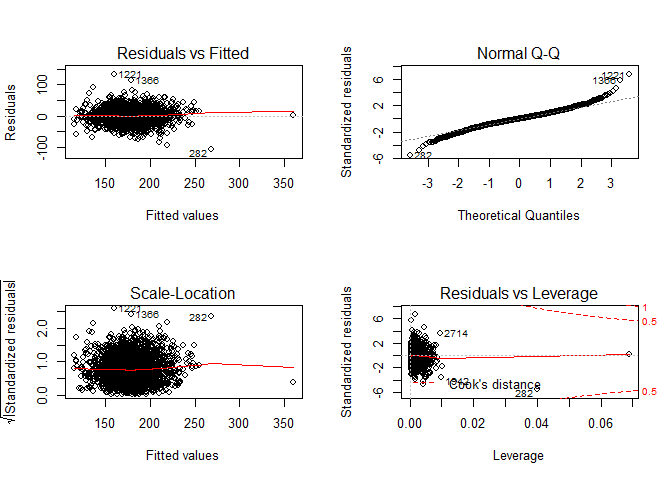

jy2947
================
Jiawei Ye

Literature review
=================

[This](https://onlinelibrary.wiley.com/doi/full/10.1002/ijc.29210) article shows that cancer incidence and mortality rates differ in developing countries and developed countries. Mortality rates also differ for cancers at different sites. But we only have data for all cancer combined.

[This](https://jamanetwork.com/journals/jama/fullarticle/2598772) article shows age-standardized mortality rate for neoplasms differs across counties in 2014. This article's model is using covariates pretty similar to what our dataset has.

\*age-standardized mortality rate: The age-standardized mortality rate is a weighted average of the age-specific mortality rates per 100,000 persons, where the weights are the proportions of persons in the corresponding age groups of the WHO standard population. WHO, [link](https://www.who.int/whosis/whostat2006AgeStandardizedDeathRates.pdf)

[This](https://www.ncbi.nlm.nih.gov/pmc/articles/PMC5376950/) article is saying mortality differs aross races.

### Load Main dataset

``` r
cancer_reg = read_csv("./data/Cancer_Registry.csv") %>%
  janitor::clean_names() %>%
  dplyr::select(target_death_rate, everything()) %>%
  separate(geography, into = c("county", "state"), sep = ", ") %>% 
  mutate(
    avg_deaths_per_year = as.numeric(avg_deaths_per_year),
    med_income = as.numeric(med_income),
    pop_est2015 = as.numeric(med_income),
    county = str_replace(county, " ", ""),
    log_med_income = log(med_income))
```

    ## Parsed with column specification:
    ## cols(
    ##   .default = col_double(),
    ##   binnedInc = col_character(),
    ##   Geography = col_character()
    ## )

    ## See spec(...) for full column specifications.

### Add Smoking Pravalence (current/previous smokers)

-   Lung cancer account for highest proportion of cancer deaths. ~20% of lung cancer patients have never smoked. Smoking prevalence within a state is important indicator for mortality.

``` r
tobacco_2013 = read_csv(file = "./data/BRFD_tobacco_2010_present.csv") %>% 
  janitor::clean_names() %>% 
  filter(response == "Never", year == "2013", gender == "Overall") %>% 
  dplyr::select(year = "year", state = "location_desc", response, percent_never = "data_value") %>%
  mutate(
    percent_smoke = as.numeric(100 - percent_never),
    year = as.numeric(year)) %>% 
  dplyr::select(state, percent_smoke) %>% 
  filter(state != c("Guam", "National Median (States and DC)", "Puerto Rico"))
```

    ## Parsed with column specification:
    ## cols(
    ##   .default = col_character(),
    ##   Data_Value = col_double(),
    ##   Data_Value_Std_Err = col_double(),
    ##   Low_Confidence_Limit = col_double(),
    ##   High_Confidence_Limit = col_double(),
    ##   Sample_Size = col_double(),
    ##   DisplayOrder = col_double()
    ## )

    ## See spec(...) for full column specifications.

``` r
# join data on smoking prevalence by state
cancer_reg = left_join(cancer_reg, tobacco_2013, by = "state") %>% 
  dplyr::select(target_death_rate, state, county, percent_smoke, everything())

# smoking prevalence for 50 states and district of columbia
cancer_reg %>% 
  distinct(state, percent_smoke)
```

    ## # A tibble: 51 x 2
    ##    state         percent_smoke
    ##    <chr>                 <dbl>
    ##  1 Washington             42.4
    ##  2 West Virginia          51.6
    ##  3 Wisconsin              45.6
    ##  4 Nebraska               43.1
    ##  5 Nevada                 41.9
    ##  6 New Hampshire          47.3
    ##  7 New Jersey             41.4
    ##  8 New Mexico             44.5
    ##  9 New York               41.6
    ## 10 Virginia               42.8
    ## # ... with 41 more rows

### Model Building, Based on Subset

``` r
# select(-county, -state) %>%
# variables based on tidying steps
cancer_reg = cancer_reg %>% 
  mutate(mortality = avg_deaths_per_year/pop_est2015, prevalence = avg_ann_count/pop_est2015) %>%
  dplyr::select(-pop_est2015, -avg_ann_count, -avg_deaths_per_year) %>%
  mutate(study_per_cap =  
        as.factor(ifelse(study_per_cap == 0, "none", 
                         ifelse(study_per_cap < quantile(study_per_cap, .25), "low",
                         ifelse(study_per_cap < quantile(study_per_cap, .5), "medium" ,
                         ifelse(study_per_cap < quantile(study_per_cap, .75), "high", "very high")))))) %>%
  mutate(pct_non_white = pct_black+ pct_asian + pct_other_race) %>%
  dplyr::select(-pct_black, -pct_asian, -pct_other_race)

# subset based on Apoorva's selection & smoke variable
# remove state & county
cancer_reg_subset = cancer_reg %>%
  dplyr::select(
    target_death_rate, percent_smoke, incidence_rate, med_income, median_age_male, median_age_female, pct_hs18_24,
    pct_bach_deg25_over, pct_employed16_over, pct_unemployed16_over, pct_public_coverage_alone, birth_rate, mortality, prevalence,
    pct_private_coverage, pct_emp_priv_coverage, pct_public_coverage)
```

### Final Model Recommend

Adjusted R-squared: 0.4935

**4 predictor model:** target\_death\_rate ~ log(pct\_bach\_deg25\_over), incidence\_rate, pct\_private\_coverage, percent\_smoke

``` r
fit_parsimony = lm(target_death_rate ~ log(pct_bach_deg25_over) + incidence_rate + pct_private_coverage + 
    percent_smoke, data = cancer_reg_subset)

summary(fit_parsimony)
```

    ## 
    ## Call:
    ## lm(formula = target_death_rate ~ log(pct_bach_deg25_over) + incidence_rate + 
    ##     pct_private_coverage + percent_smoke, data = cancer_reg_subset)
    ## 
    ## Residuals:
    ##      Min       1Q   Median       3Q      Max 
    ## -106.462  -11.655    0.034   11.291  131.890 
    ## 
    ## Coefficients:
    ##                            Estimate Std. Error t value Pr(>|t|)    
    ## (Intercept)              117.871519   5.286673   22.30   <2e-16 ***
    ## log(pct_bach_deg25_over) -20.326164   1.195431  -17.00   <2e-16 ***
    ## incidence_rate             0.212990   0.006813   31.26   <2e-16 ***
    ## pct_private_coverage      -0.639511   0.044218  -14.46   <2e-16 ***
    ## percent_smoke              1.285369   0.089693   14.33   <2e-16 ***
    ## ---
    ## Signif. codes:  0 '***' 0.001 '**' 0.01 '*' 0.05 '.' 0.1 ' ' 1
    ## 
    ## Residual standard error: 19.75 on 3042 degrees of freedom
    ## Multiple R-squared:  0.4942, Adjusted R-squared:  0.4935 
    ## F-statistic: 742.9 on 4 and 3042 DF,  p-value: < 2.2e-16

### Ridge

``` r
grid = 10^seq(5,-2, length=100)
ridge_cancer = lm.ridge(target_death_rate ~log(pct_bach_deg25_over) + incidence_rate + pct_private_coverage + 
    percent_smoke, data = cancer_reg_subset, lambda = grid)
dim(coef(ridge_cancer))
```

    ## [1] 100   5

``` r
#coef for 10^5
coef(ridge_cancer)[1,]
```

    ##                          log(pct_bach_deg25_over)           incidence_rate 
    ##            177.079781647             -1.004756140              0.006733632 
    ##     pct_private_coverage            percent_smoke 
    ##             -0.029157980              0.066275704

``` r
# coeffcients for 10^-2
coef(ridge_cancer)[100,]
```

    ##                          log(pct_bach_deg25_over)           incidence_rate 
    ##              117.8717128              -20.3261339                0.2129894 
    ##     pct_private_coverage            percent_smoke 
    ##               -0.6395088                1.2853673

``` r
response = 
  cancer_reg_subset %>% 
  dplyr::select(target_death_rate, pct_bach_deg25_over, incidence_rate, pct_private_coverage, percent_smoke) %>% 
  drop_na() %>% 
  dplyr::select(target_death_rate) %>% 
  as.matrix()

predictors = 
  cancer_reg_subset %>% 
  dplyr::select(target_death_rate, pct_bach_deg25_over, incidence_rate, pct_private_coverage, percent_smoke) %>% 
  drop_na() %>% 
  dplyr::select(-target_death_rate) %>% 
  as.matrix()

ridge_cancer_1 = glmnet(predictors, response, alpha = 0, lambda = grid)
dim(coef(ridge_cancer_1))
```

    ## [1]   5 100

``` r
ridge_cancer_1$lambda[50] 
```

    ## [1] 34.30469

``` r
coef(ridge_cancer_1)[,50]
```

    ##          (Intercept)  pct_bach_deg25_over       incidence_rate 
    ##         133.23219618          -0.86734978           0.09753574 
    ## pct_private_coverage        percent_smoke 
    ##          -0.35434254           0.80616779

### Ridge CV

``` r
set.seed(1)

cancer_train = sample(1:nrow(predictors),nrow(predictors)/2)

cancer_test = (-cancer_train)

response_test = response[cancer_test]


# Use build-in CV function; performs a 10-fold validation by default
# glmnet() generates it's own lambda sequence

set.seed(2)
cv_out = cv.glmnet(predictors[cancer_train,], response[cancer_train], alpha=0)
plot(cv_out)
```



``` r
# cv.glmnet() object contains the mean cross-validation error (cvm),
# lambda min that gives the minimum cvm, etc.
cv_out
```

    ## $lambda
    ##  [1] 14322.756266 13050.362076 11891.003878 10834.639867  9872.120324
    ##  [6]  8995.108364  8196.007729  7467.896992  6804.469606  6199.979281
    ## [11]  5649.190210  5147.331722  4690.056959  4273.405225  3893.767684
    ## [16]  3547.856094  3232.674338  2945.492459  2683.823028  2445.399587
    ## [21]  2228.157028  2030.213699  1849.855109  1685.519080  1535.782210
    ## [26]  1399.347552  1275.033372  1161.762922  1058.555106   964.515988
    ## [31]   878.831046   800.758118   729.620974   664.803457   605.744151
    ## [36]   551.931510   502.899436   458.223236   417.515947   380.424981
    ## [41]   346.629074   315.835502   287.777547   262.212183   238.917975
    ## [46]   217.693161   198.353900   180.732687   164.676893   150.047452
    ## [51]   136.717649   124.572030   113.505394   103.421888    94.234173
    ## [56]    85.862668    78.234866    71.284696    64.951960    59.181807
    ## [61]    53.924258    49.133776    44.768867    40.791724    37.167899
    ## [66]    33.866006    30.857443    28.116153    25.618391    23.342524
    ## [71]    21.268839    19.379374    17.657763    16.089096    14.659785
    ## [76]    13.357451    12.170811    11.089590    10.104421     9.206773
    ## [81]     8.388868     7.643624     6.964586     6.345871     5.782121
    ## [86]     5.268454     4.800419     4.373963     3.985392     3.631341
    ## [91]     3.308742     3.014803     2.746976     2.502942     2.280588
    ## [96]     2.077987     1.893384     1.725181     1.571921
    ## 
    ## $cvm
    ##  [1] 802.4806 800.3205 799.8737 799.6060 799.3125 798.9907 798.6380
    ##  [8] 798.2515 797.8280 797.3639 796.8555 796.2987 795.6890 795.0214
    ## [15] 794.2907 793.4912 792.6164 791.6598 790.6140 789.4710 788.2224
    ## [22] 786.8590 785.3710 783.7478 781.9782 780.0502 777.9511 775.6674
    ## [29] 773.1849 770.4888 767.5634 764.3927 760.9600 757.2484 753.2407
    ## [36] 748.9196 744.2681 739.2695 733.9080 728.1689 722.0389 715.5068
    ## [43] 708.5637 701.2036 693.4240 685.2263 676.6165 667.6055 658.2096
    ## [50] 648.4508 638.3571 627.9624 617.3067 606.4358 595.4006 584.2566
    ## [57] 573.0632 561.8823 550.7776 539.8127 529.0503 518.5506 508.3699
    ## [64] 498.5594 489.1644 480.2233 471.7669 463.8183 456.3926 449.4972
    ## [71] 443.1324 437.2914 431.9622 427.1265 422.7621 418.8440 415.3444
    ## [78] 412.2340 409.4827 407.0600 404.9363 403.0825 401.4709 400.0754
    ## [85] 398.8716 397.8370 396.9511 396.1950 395.5519 395.0064 394.5453
    ## [92] 394.1565 393.8303 393.5573 393.3296 393.1402 392.9832 392.8536
    ## [99] 392.7469
    ## 
    ## $cvsd
    ##  [1] 32.34877 32.25778 32.18962 32.17775 32.16474 32.15048 32.13484
    ##  [8] 32.11771 32.09894 32.07838 32.05585 32.03119 32.00418 31.97461
    ## [15] 31.94225 31.90684 31.86811 31.82577 31.77948 31.72891 31.67368
    ## [22] 31.61338 31.54760 31.47587 31.39770 31.31257 31.21993 31.11920
    ## [29] 31.00977 30.89101 30.76226 30.62284 30.47206 30.30922 30.13364
    ## [36] 29.94461 29.74149 29.52365 29.29054 29.04168 28.77666 28.49525
    ## [43] 28.19732 27.88295 27.55240 27.20620 26.84511 26.47021 26.08285
    ## [50] 25.68473 25.27784 24.86453 24.44738 24.02927 23.61326 23.20252
    ## [57] 22.80029 22.40972 22.03383 21.67533 21.33661 21.01956 20.72556
    ## [64] 20.45545 20.20949 19.98740 19.78841 19.61134 19.45467 19.31670
    ## [71] 19.19556 19.08937 18.99628 18.91460 18.84266 18.77908 18.72260
    ## [78] 18.67218 18.62692 18.58610 18.54912 18.51548 18.48481 18.45678
    ## [85] 18.43113 18.40765 18.38616 18.36652 18.34868 18.33229 18.31737
    ## [92] 18.30352 18.29101 18.27972 18.26946 18.26015 18.25172 18.24408
    ## [99] 18.23717
    ## 
    ## $cvup
    ##  [1] 834.8293 832.5783 832.0633 831.7837 831.4772 831.1412 830.7729
    ##  [8] 830.3692 829.9269 829.4423 828.9114 828.3299 827.6931 826.9960
    ## [15] 826.2330 825.3980 824.4845 823.4856 822.3934 821.1999 819.8961
    ## [22] 818.4724 816.9186 815.2236 813.3759 811.3628 809.1710 806.7866
    ## [29] 804.1947 801.3798 798.3256 795.0155 791.4321 787.5576 783.3743
    ## [36] 778.8642 774.0095 768.7931 763.1985 757.2106 750.8156 744.0021
    ## [43] 736.7610 729.0865 720.9764 712.4325 703.4616 694.0757 684.2925
    ## [50] 674.1355 663.6349 652.8269 641.7541 630.4651 619.0138 607.4591
    ## [57] 595.8635 584.2920 572.8114 561.4880 550.3869 539.5702 529.0954
    ## [64] 519.0149 509.3739 500.2107 491.5553 483.4296 475.8472 468.8139
    ## [71] 462.3279 456.3808 450.9585 446.0411 441.6048 437.6231 434.0670
    ## [78] 430.9062 428.1096 425.6461 423.4854 421.5980 419.9557 418.5322
    ## [85] 417.3027 416.2446 415.3373 414.5615 413.9006 413.3386 412.8627
    ## [92] 412.4601 412.1213 411.8371 411.5991 411.4004 411.2350 411.0977
    ## [99] 410.9841
    ## 
    ## $cvlo
    ##  [1] 770.1318 768.0628 767.6841 767.4282 767.1477 766.8402 766.5032
    ##  [8] 766.1338 765.7290 765.2855 764.7997 764.2675 763.6848 763.0468
    ## [15] 762.3485 761.5843 760.7483 759.8340 758.8345 757.7421 756.5487
    ## [22] 755.2456 753.8234 752.2719 750.5805 748.7376 746.7312 744.5482
    ## [29] 742.1751 739.5977 736.8011 733.7698 730.4879 726.9392 723.1071
    ## [36] 718.9750 714.5266 709.7458 704.6175 699.1272 693.2623 687.0116
    ## [43] 680.3664 673.3206 665.8716 658.0201 649.7714 641.1353 632.1268
    ## [50] 622.7661 613.0792 603.0978 592.8593 582.4065 571.7873 561.0541
    ## [57] 550.2629 539.4726 528.7437 518.1374 507.7137 497.5311 487.6443
    ## [64] 478.1039 468.9549 460.2359 451.9785 444.2069 436.9379 430.1805
    ## [71] 423.9368 418.2020 412.9659 408.2119 403.9195 400.0649 396.6218
    ## [78] 393.5618 390.8557 388.4739 386.3872 384.5670 382.9861 381.6186
    ## [85] 380.4405 379.4293 378.5650 377.8284 377.2032 376.6741 376.2280
    ## [92] 375.8530 375.5393 375.2776 375.0602 374.8801 374.7315 374.6095
    ## [99] 374.5098
    ## 
    ## $nzero
    ##  s0  s1  s2  s3  s4  s5  s6  s7  s8  s9 s10 s11 s12 s13 s14 s15 s16 s17 
    ##   4   4   4   4   4   4   4   4   4   4   4   4   4   4   4   4   4   4 
    ## s18 s19 s20 s21 s22 s23 s24 s25 s26 s27 s28 s29 s30 s31 s32 s33 s34 s35 
    ##   4   4   4   4   4   4   4   4   4   4   4   4   4   4   4   4   4   4 
    ## s36 s37 s38 s39 s40 s41 s42 s43 s44 s45 s46 s47 s48 s49 s50 s51 s52 s53 
    ##   4   4   4   4   4   4   4   4   4   4   4   4   4   4   4   4   4   4 
    ## s54 s55 s56 s57 s58 s59 s60 s61 s62 s63 s64 s65 s66 s67 s68 s69 s70 s71 
    ##   4   4   4   4   4   4   4   4   4   4   4   4   4   4   4   4   4   4 
    ## s72 s73 s74 s75 s76 s77 s78 s79 s80 s81 s82 s83 s84 s85 s86 s87 s88 s89 
    ##   4   4   4   4   4   4   4   4   4   4   4   4   4   4   4   4   4   4 
    ## s90 s91 s92 s93 s94 s95 s96 s97 s98 
    ##   4   4   4   4   4   4   4   4   4 
    ## 
    ## $name
    ##                  mse 
    ## "Mean-Squared Error" 
    ## 
    ## $glmnet.fit
    ## 
    ## Call:  glmnet(x = predictors[cancer_train, ], y = response[cancer_train],      alpha = 0) 
    ## 
    ##        Df      %Dev    Lambda
    ##   [1,]  4 1.471e-36 14320.000
    ##   [2,]  4 3.147e-03 13050.000
    ##   [3,]  4 3.452e-03 11890.000
    ##   [4,]  4 3.786e-03 10830.000
    ##   [5,]  4 4.153e-03  9872.000
    ##   [6,]  4 4.555e-03  8995.000
    ##   [7,]  4 4.996e-03  8196.000
    ##   [8,]  4 5.479e-03  7468.000
    ##   [9,]  4 6.009e-03  6804.000
    ##  [10,]  4 6.589e-03  6200.000
    ##  [11,]  4 7.224e-03  5649.000
    ##  [12,]  4 7.920e-03  5147.000
    ##  [13,]  4 8.682e-03  4690.000
    ##  [14,]  4 9.517e-03  4273.000
    ##  [15,]  4 1.043e-02  3894.000
    ##  [16,]  4 1.143e-02  3548.000
    ##  [17,]  4 1.252e-02  3233.000
    ##  [18,]  4 1.372e-02  2945.000
    ##  [19,]  4 1.503e-02  2684.000
    ##  [20,]  4 1.645e-02  2445.000
    ##  [21,]  4 1.802e-02  2228.000
    ##  [22,]  4 1.972e-02  2030.000
    ##  [23,]  4 2.158e-02  1850.000
    ##  [24,]  4 2.361e-02  1686.000
    ##  [25,]  4 2.582e-02  1536.000
    ##  [26,]  4 2.823e-02  1399.000
    ##  [27,]  4 3.085e-02  1275.000
    ##  [28,]  4 3.371e-02  1162.000
    ##  [29,]  4 3.681e-02  1059.000
    ##  [30,]  4 4.018e-02   964.500
    ##  [31,]  4 4.384e-02   878.800
    ##  [32,]  4 4.780e-02   800.800
    ##  [33,]  4 5.209e-02   729.600
    ##  [34,]  4 5.673e-02   664.800
    ##  [35,]  4 6.174e-02   605.700
    ##  [36,]  4 6.714e-02   551.900
    ##  [37,]  4 7.296e-02   502.900
    ##  [38,]  4 7.921e-02   458.200
    ##  [39,]  4 8.591e-02   417.500
    ##  [40,]  4 9.308e-02   380.400
    ##  [41,]  4 1.007e-01   346.600
    ##  [42,]  4 1.089e-01   315.800
    ##  [43,]  4 1.176e-01   287.800
    ##  [44,]  4 1.268e-01   262.200
    ##  [45,]  4 1.365e-01   238.900
    ##  [46,]  4 1.468e-01   217.700
    ##  [47,]  4 1.575e-01   198.400
    ##  [48,]  4 1.688e-01   180.700
    ##  [49,]  4 1.805e-01   164.700
    ##  [50,]  4 1.927e-01   150.000
    ##  [51,]  4 2.054e-01   136.700
    ##  [52,]  4 2.184e-01   124.600
    ##  [53,]  4 2.317e-01   113.500
    ##  [54,]  4 2.453e-01   103.400
    ##  [55,]  4 2.591e-01    94.230
    ##  [56,]  4 2.730e-01    85.860
    ##  [57,]  4 2.870e-01    78.230
    ##  [58,]  4 3.010e-01    71.280
    ##  [59,]  4 3.149e-01    64.950
    ##  [60,]  4 3.286e-01    59.180
    ##  [61,]  4 3.421e-01    53.920
    ##  [62,]  4 3.552e-01    49.130
    ##  [63,]  4 3.679e-01    44.770
    ##  [64,]  4 3.802e-01    40.790
    ##  [65,]  4 3.920e-01    37.170
    ##  [66,]  4 4.032e-01    33.870
    ##  [67,]  4 4.138e-01    30.860
    ##  [68,]  4 4.237e-01    28.120
    ##  [69,]  4 4.330e-01    25.620
    ##  [70,]  4 4.417e-01    23.340
    ##  [71,]  4 4.497e-01    21.270
    ##  [72,]  4 4.570e-01    19.380
    ##  [73,]  4 4.637e-01    17.660
    ##  [74,]  4 4.698e-01    16.090
    ##  [75,]  4 4.753e-01    14.660
    ##  [76,]  4 4.803e-01    13.360
    ##  [77,]  4 4.847e-01    12.170
    ##  [78,]  4 4.887e-01    11.090
    ##  [79,]  4 4.922e-01    10.100
    ##  [80,]  4 4.952e-01     9.207
    ##  [81,]  4 4.980e-01     8.389
    ##  [82,]  4 5.003e-01     7.644
    ##  [83,]  4 5.024e-01     6.965
    ##  [84,]  4 5.042e-01     6.346
    ##  [85,]  4 5.058e-01     5.782
    ##  [86,]  4 5.071e-01     5.268
    ##  [87,]  4 5.083e-01     4.800
    ##  [88,]  4 5.093e-01     4.374
    ##  [89,]  4 5.101e-01     3.985
    ##  [90,]  4 5.109e-01     3.631
    ##  [91,]  4 5.115e-01     3.309
    ##  [92,]  4 5.120e-01     3.015
    ##  [93,]  4 5.125e-01     2.747
    ##  [94,]  4 5.129e-01     2.503
    ##  [95,]  4 5.132e-01     2.281
    ##  [96,]  4 5.135e-01     2.078
    ##  [97,]  4 5.137e-01     1.893
    ##  [98,]  4 5.139e-01     1.725
    ##  [99,]  4 5.141e-01     1.572
    ## [100,]  4 5.142e-01     1.432
    ## 
    ## $lambda.min
    ## [1] 1.571921
    ## 
    ## $lambda.1se
    ## [1] 10.10442
    ## 
    ## attr(,"class")
    ## [1] "cv.glmnet"

``` r
best_lambda = cv_out$lambda.min
best_lambda       
```

    ## [1] 1.571921

``` r
# Re-fit the model with the min lambda value, look at the coeff and MSE
#ridge_pred = predict(ridge.cv, s=best_lambda, new_pred = predictors[cancer_test,])
#mean((ridge_pred - response_test)^2)


# Ridge regression using all observations and 'best' lambda
ridge_pred = glmnet(predictors, response, alpha = 0, lambda = best_lambda)

#Compare LS method and ridge
compare_ridge_ls = cbind(coef(fit_parsimony), coef(ridge_pred))
colnames(compare_ridge_ls) <- c("LS", "Ridge")
compare_ridge_ls
```

    ## 5 x 2 sparse Matrix of class "dgCMatrix"
    ##                               LS      Ridge
    ## (Intercept)          117.8715191 90.4365124
    ## pct_bach_deg25_over  -20.3261644 -1.4146263
    ## incidence_rate         0.2129901  0.2017383
    ## pct_private_coverage  -0.6395105 -0.6440314
    ## percent_smoke          1.2853689  1.2982962
