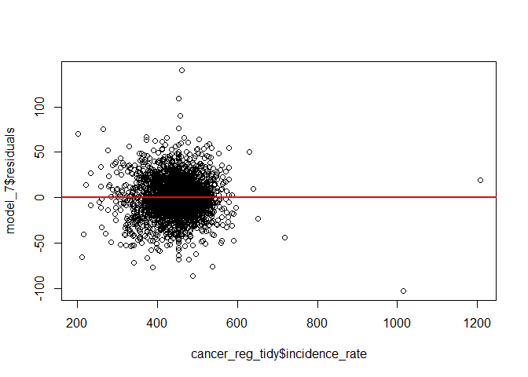
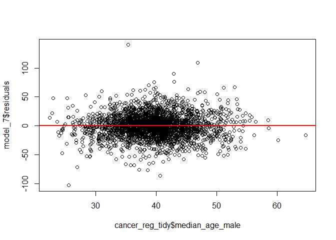
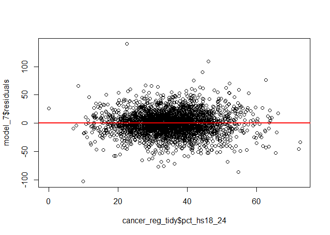
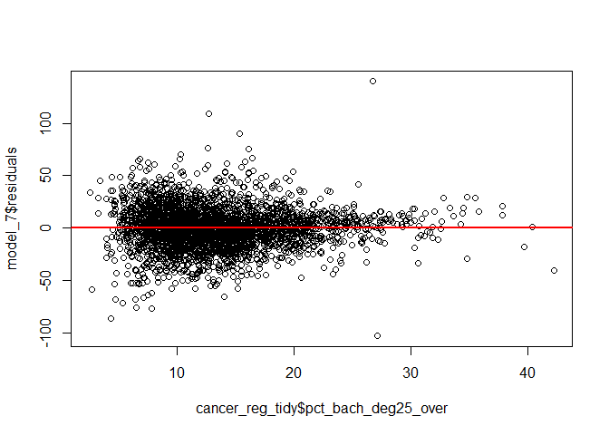
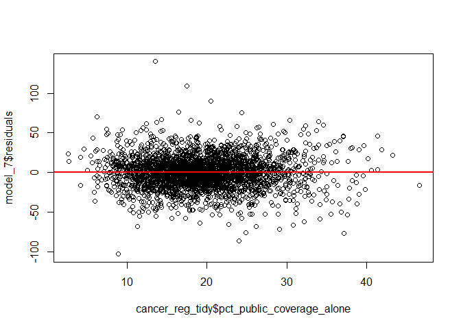
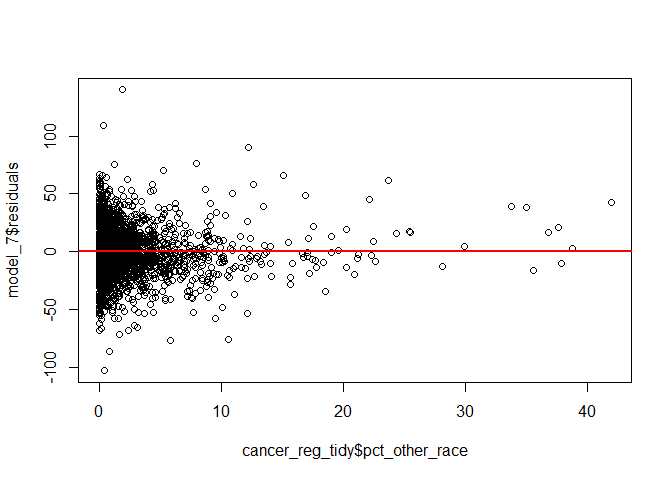
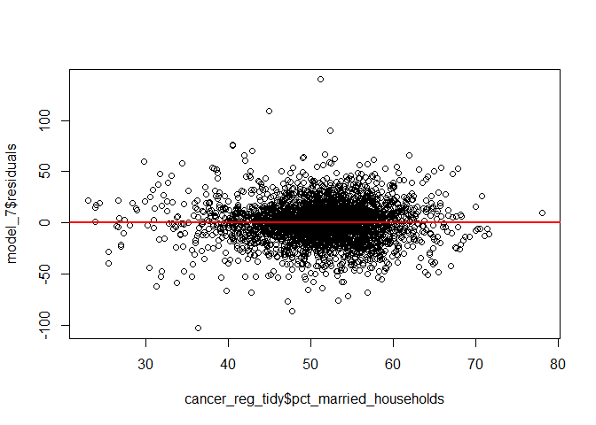
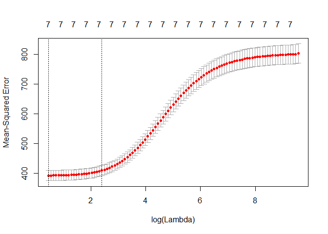

jy2947-Dec15
================
Jiawei Ye
December 15, 2018

### The final model we decided

``` r
#load
cancer_reg = read_csv("./data/Cancer_Registry.csv") %>%
  janitor::clean_names() %>%
  dplyr::select(target_death_rate, everything()) %>%
  separate(geography, into = c("county", "state"), sep = ", ") %>% 
  mutate(county = str_replace(county, " ", ""))
```

    ## Parsed with column specification:
    ## cols(
    ##   .default = col_double(),
    ##   binnedInc = col_character(),
    ##   Geography = col_character()
    ## )

    ## See spec(...) for full column specifications.

``` r
#exclude variables with a lot missing data, categorical variables and high collinearity variables
cancer_reg_tidy = 
  cancer_reg %>% 
  dplyr::select(-pct_employed16_over, -pct_some_col18_24, -pct_private_coverage_alone, #missing data
                -county, -state, -binned_inc, -avg_ann_count, -avg_deaths_per_year) %>%   #categorical, colinearity
  dplyr::select(-med_income, -median_age_female, -pct_emp_priv_coverage, 
                -pct_public_coverage, -pct_private_coverage,  -poverty_percent, 
                -pct_hs25_over, -percent_married) %>% #colinearity
  mutate(pct_nonwhite = 1 - pct_white)

# define full and null sets for forward, backward, both ways search procedures
null = lm(target_death_rate ~ 1, data = cancer_reg_tidy)

full = lm(target_death_rate ~ ., data = cancer_reg_tidy)

# forward
step(null, scope = list(lower = null, upper = full), direction = "forward")
```

    ## Start:  AIC=20253.13
    ## target_death_rate ~ 1
    ## 
    ##                             Df Sum of Sq     RSS   AIC
    ## + pct_bach_deg25_over        1    552893 1792973 19436
    ## + incidence_rate             1    473839 1872027 19568
    ## + pct_public_coverage_alone  1    473682 1872183 19568
    ## + pct_unemployed16_over      1    335919 2009947 19784
    ## + pct_married_households     1    201838 2144028 19981
    ## + pct_bach_deg18_24          1    194329 2151537 19992
    ## + pct_hs18_24                1    161000 2184866 20039
    ## + pct_black                  1    154971 2190895 20047
    ## + pct_other_race             1     84591 2261275 20143
    ## + pct_asian                  1     81447 2264419 20148
    ## + pct_white                  1     73826 2272040 20158
    ## + pct_nonwhite               1     73826 2272040 20158
    ## + pop_est2015                1     33822 2312044 20211
    ## + pct_no_hs18_24             1     18358 2327508 20231
    ## + birth_rate                 1     17922 2327944 20232
    ## + avg_household_size         1      3195 2342671 20251
    ## <none>                                   2345866 20253
    ## + study_per_cap              1      1165 2344701 20254
    ## + median_age_male            1      1128 2344738 20254
    ## + median_age                 1        45 2345821 20255
    ## 
    ## Step:  AIC=19436.16
    ## target_death_rate ~ pct_bach_deg25_over
    ## 
    ##                             Df Sum of Sq     RSS   AIC
    ## + incidence_rate             1    436199 1356774 18589
    ## + pct_married_households     1    142974 1649999 19185
    ## + pct_unemployed16_over      1    106117 1686856 19252
    ## + pct_public_coverage_alone  1     89344 1703629 19282
    ## + pct_black                  1     82887 1710086 19294
    ## + pct_other_race             1     68639 1724334 19319
    ## + pct_white                  1     55608 1737365 19342
    ## + pct_nonwhite               1     55608 1737365 19342
    ## + birth_rate                 1     40016 1752957 19369
    ## + pct_no_hs18_24             1     30147 1762826 19387
    ## + median_age_male            1     17581 1775392 19408
    ## + pct_hs18_24                1     12028 1780945 19418
    ## + study_per_cap              1      2199 1790774 19434
    ## + avg_household_size         1      2133 1790840 19435
    ## + pct_asian                  1      2006 1790967 19435
    ## + pop_est2015                1      1525 1791448 19436
    ## <none>                                   1792973 19436
    ## + median_age                 1        71 1792902 19438
    ## + pct_bach_deg18_24          1        42 1792931 19438
    ## 
    ## Step:  AIC=18588.76
    ## target_death_rate ~ pct_bach_deg25_over + incidence_rate
    ## 
    ##                             Df Sum of Sq     RSS   AIC
    ## + pct_public_coverage_alone  1     80817 1275957 18404
    ## + pct_married_households     1     79924 1276850 18406
    ## + pct_unemployed16_over      1     70660 1286114 18428
    ## + pct_white                  1     51737 1305036 18472
    ## + pct_nonwhite               1     51737 1305036 18472
    ## + pct_black                  1     47135 1309639 18483
    ## + pct_other_race             1     16303 1340471 18554
    ## + birth_rate                 1     14471 1342302 18558
    ## + median_age_male            1     14267 1342507 18559
    ## + pct_hs18_24                1     10915 1345859 18566
    ## + pct_bach_deg18_24          1      2635 1354139 18585
    ## + pct_no_hs18_24             1      1651 1355123 18587
    ## + pct_asian                  1      1480 1355294 18587
    ## + avg_household_size         1      1021 1355753 18589
    ## <none>                                   1356774 18589
    ## + median_age                 1       395 1356379 18590
    ## + pop_est2015                1       158 1356616 18590
    ## + study_per_cap              1        53 1356721 18591
    ## 
    ## Step:  AIC=18403.64
    ## target_death_rate ~ pct_bach_deg25_over + incidence_rate + pct_public_coverage_alone
    ## 
    ##                          Df Sum of Sq     RSS   AIC
    ## + pct_other_race          1   28916.0 1247041 18336
    ## + pct_married_households  1   24502.3 1251455 18347
    ## + pct_black               1   18664.6 1257292 18361
    ## + pct_unemployed16_over   1   15216.5 1260741 18369
    ## + pct_white               1   14355.2 1261602 18371
    ## + pct_nonwhite            1   14355.2 1261602 18371
    ## + pct_hs18_24             1   11850.9 1264106 18377
    ## + birth_rate              1   10071.1 1265886 18382
    ## + median_age_male         1    8493.2 1267464 18385
    ## + pct_no_hs18_24          1    5953.3 1270004 18391
    ## + pop_est2015             1    1585.4 1274372 18402
    ## <none>                                1275957 18404
    ## + pct_bach_deg18_24       1     608.8 1275348 18404
    ## + median_age              1     201.3 1275756 18405
    ## + study_per_cap           1     109.3 1275848 18405
    ## + avg_household_size      1      38.4 1275919 18406
    ## + pct_asian               1      27.1 1275930 18406
    ## 
    ## Step:  AIC=18335.79
    ## target_death_rate ~ pct_bach_deg25_over + incidence_rate + pct_public_coverage_alone + 
    ##     pct_other_race
    ## 
    ##                          Df Sum of Sq     RSS   AIC
    ## + pct_white               1   24974.5 1222067 18276
    ## + pct_nonwhite            1   24974.5 1222067 18276
    ## + pct_married_households  1   23831.6 1223210 18279
    ## + median_age_male         1   20202.2 1226839 18288
    ## + pct_black               1   16845.6 1230195 18296
    ## + pct_unemployed16_over   1   14407.7 1232633 18302
    ## + pct_hs18_24             1   10213.5 1236828 18313
    ## + birth_rate              1    8453.4 1238588 18317
    ## + pct_no_hs18_24          1    3631.1 1243410 18329
    ## + avg_household_size      1    1692.1 1245349 18334
    ## + pct_asian               1    1568.4 1245473 18334
    ## <none>                                1247041 18336
    ## + pct_bach_deg18_24       1     523.9 1246517 18337
    ## + median_age              1     333.2 1246708 18337
    ## + study_per_cap           1     125.2 1246916 18338
    ## + pop_est2015             1       0.0 1247041 18338
    ## 
    ## Step:  AIC=18276.15
    ## target_death_rate ~ pct_bach_deg25_over + incidence_rate + pct_public_coverage_alone + 
    ##     pct_other_race + pct_white
    ## 
    ##                          Df Sum of Sq     RSS   AIC
    ## + pct_hs18_24             1   12383.1 1209683 18247
    ## + birth_rate              1    9356.8 1212710 18255
    ## + median_age_male         1    8033.8 1214033 18258
    ## + pct_married_households  1    7434.5 1214632 18260
    ## + pct_no_hs18_24          1    5761.1 1216305 18264
    ## + pct_unemployed16_over   1    3995.1 1218071 18268
    ## <none>                                1222067 18276
    ## + pct_bach_deg18_24       1     416.1 1221650 18277
    ## + avg_household_size      1     399.3 1221667 18277
    ## + pop_est2015             1     310.0 1221757 18277
    ## + median_age              1     198.5 1221868 18278
    ## + study_per_cap           1      50.2 1222016 18278
    ## + pct_black               1      46.4 1222020 18278
    ## + pct_asian               1      10.5 1222056 18278
    ## 
    ## Step:  AIC=18247.12
    ## target_death_rate ~ pct_bach_deg25_over + incidence_rate + pct_public_coverage_alone + 
    ##     pct_other_race + pct_white + pct_hs18_24
    ## 
    ##                          Df Sum of Sq     RSS   AIC
    ## + median_age_male         1   12821.8 1196862 18217
    ## + pct_married_households  1   12166.7 1197517 18218
    ## + birth_rate              1   10007.8 1199676 18224
    ## + pct_no_hs18_24          1    4521.9 1205162 18238
    ## + pct_unemployed16_over   1    3927.9 1205756 18239
    ## <none>                                1209683 18247
    ## + median_age              1     358.0 1209326 18248
    ## + pop_est2015             1     247.3 1209436 18249
    ## + avg_household_size      1     182.8 1209501 18249
    ## + study_per_cap           1      27.2 1209656 18249
    ## + pct_asian               1      10.5 1209673 18249
    ## + pct_bach_deg18_24       1       6.3 1209677 18249
    ## + pct_black               1       4.5 1209679 18249
    ## 
    ## Step:  AIC=18216.65
    ## target_death_rate ~ pct_bach_deg25_over + incidence_rate + pct_public_coverage_alone + 
    ##     pct_other_race + pct_white + pct_hs18_24 + median_age_male
    ## 
    ##                          Df Sum of Sq     RSS   AIC
    ## + birth_rate              1   13242.8 1183619 18185
    ## + pct_married_households  1   11751.3 1185110 18189
    ## + pct_unemployed16_over   1    3087.4 1193774 18211
    ## + pct_no_hs18_24          1    2482.4 1194379 18212
    ## <none>                                1196862 18217
    ## + avg_household_size      1     443.0 1196419 18218
    ## + pop_est2015             1     366.1 1196496 18218
    ## + pct_black               1     207.1 1196655 18218
    ## + pct_bach_deg18_24       1     179.8 1196682 18218
    ## + pct_asian               1      90.8 1196771 18218
    ## + study_per_cap           1      77.4 1196784 18219
    ## + median_age              1      31.4 1196830 18219
    ## 
    ## Step:  AIC=18184.75
    ## target_death_rate ~ pct_bach_deg25_over + incidence_rate + pct_public_coverage_alone + 
    ##     pct_other_race + pct_white + pct_hs18_24 + median_age_male + 
    ##     birth_rate
    ## 
    ##                          Df Sum of Sq     RSS   AIC
    ## + pct_married_households  1    9580.5 1174038 18162
    ## + pct_unemployed16_over   1    1980.7 1181638 18182
    ## + pct_no_hs18_24          1    1444.6 1182174 18183
    ## <none>                                1183619 18185
    ## + pop_est2015             1     540.9 1183078 18185
    ## + avg_household_size      1     346.7 1183272 18186
    ## + pct_asian               1     214.5 1183404 18186
    ## + study_per_cap           1      29.2 1183590 18187
    ## + pct_bach_deg18_24       1      24.9 1183594 18187
    ## + median_age              1      24.2 1183595 18187
    ## + pct_black               1       0.0 1183619 18187
    ## 
    ## Step:  AIC=18161.98
    ## target_death_rate ~ pct_bach_deg25_over + incidence_rate + pct_public_coverage_alone + 
    ##     pct_other_race + pct_white + pct_hs18_24 + median_age_male + 
    ##     birth_rate + pct_married_households
    ## 
    ##                         Df Sum of Sq     RSS   AIC
    ## + pct_unemployed16_over  1   1765.12 1172273 18159
    ## <none>                               1174038 18162
    ## + pop_est2015            1    661.97 1173376 18162
    ## + pct_no_hs18_24         1    407.02 1173631 18163
    ## + study_per_cap          1    172.17 1173866 18164
    ## + pct_black              1    146.65 1173892 18164
    ## + pct_asian              1    101.76 1173937 18164
    ## + pct_bach_deg18_24      1     50.55 1173988 18164
    ## + avg_household_size     1     48.18 1173990 18164
    ## + median_age             1     40.24 1173998 18164
    ## 
    ## Step:  AIC=18159.4
    ## target_death_rate ~ pct_bach_deg25_over + incidence_rate + pct_public_coverage_alone + 
    ##     pct_other_race + pct_white + pct_hs18_24 + median_age_male + 
    ##     birth_rate + pct_married_households + pct_unemployed16_over
    ## 
    ##                      Df Sum of Sq     RSS   AIC
    ## + pop_est2015         1    790.39 1171483 18159
    ## <none>                            1172273 18159
    ## + pct_no_hs18_24      1    350.32 1171923 18161
    ## + study_per_cap       1    176.07 1172097 18161
    ## + pct_black           1    171.83 1172101 18161
    ## + pct_asian           1    122.05 1172151 18161
    ## + median_age          1     70.32 1172203 18161
    ## + pct_bach_deg18_24   1     10.41 1172263 18161
    ## + avg_household_size  1      9.62 1172264 18161
    ## 
    ## Step:  AIC=18159.34
    ## target_death_rate ~ pct_bach_deg25_over + incidence_rate + pct_public_coverage_alone + 
    ##     pct_other_race + pct_white + pct_hs18_24 + median_age_male + 
    ##     birth_rate + pct_married_households + pct_unemployed16_over + 
    ##     pop_est2015
    ## 
    ##                      Df Sum of Sq     RSS   AIC
    ## <none>                            1171483 18159
    ## + pct_no_hs18_24      1    407.06 1171076 18160
    ## + pct_black           1    198.25 1171285 18161
    ## + study_per_cap       1    159.92 1171323 18161
    ## + median_age          1     74.11 1171409 18161
    ## + avg_household_size  1     18.14 1171465 18161
    ## + pct_asian           1      3.59 1171479 18161
    ## + pct_bach_deg18_24   1      0.00 1171483 18161

    ## 
    ## Call:
    ## lm(formula = target_death_rate ~ pct_bach_deg25_over + incidence_rate + 
    ##     pct_public_coverage_alone + pct_other_race + pct_white + 
    ##     pct_hs18_24 + median_age_male + birth_rate + pct_married_households + 
    ##     pct_unemployed16_over + pop_est2015, data = cancer_reg_tidy)
    ## 
    ## Coefficients:
    ##               (Intercept)        pct_bach_deg25_over  
    ##                 1.398e+02                 -1.653e+00  
    ##            incidence_rate  pct_public_coverage_alone  
    ##                 1.903e-01                  6.388e-01  
    ##            pct_other_race                  pct_white  
    ##                -1.038e+00                 -5.818e-02  
    ##               pct_hs18_24            median_age_male  
    ##                 3.450e-01                 -4.905e-01  
    ##                birth_rate     pct_married_households  
    ##                -9.575e-01                 -3.817e-01  
    ##     pct_unemployed16_over                pop_est2015  
    ##                 3.334e-01                 -1.714e-06

``` r
fit_forward = lm(formula = target_death_rate ~ pct_bach_deg25_over + incidence_rate + 
    pct_public_coverage_alone + pct_other_race + pct_white + 
    pct_hs18_24 + median_age_male + birth_rate + pct_married_households + 
    pct_unemployed16_over + pop_est2015, data = cancer_reg_tidy)
##11 predictor model with 2 not significant, R^2(adj) = 0.4988
summary(fit_forward) 
```

    ## 
    ## Call:
    ## lm(formula = target_death_rate ~ pct_bach_deg25_over + incidence_rate + 
    ##     pct_public_coverage_alone + pct_other_race + pct_white + 
    ##     pct_hs18_24 + median_age_male + birth_rate + pct_married_households + 
    ##     pct_unemployed16_over + pop_est2015, data = cancer_reg_tidy)
    ## 
    ## Residuals:
    ##      Min       1Q   Median       3Q      Max 
    ## -104.490  -11.255   -0.372   11.029  137.939 
    ## 
    ## Coefficients:
    ##                             Estimate Std. Error t value Pr(>|t|)    
    ## (Intercept)                1.398e+02  6.989e+00  20.004  < 2e-16 ***
    ## pct_bach_deg25_over       -1.653e+00  9.506e-02 -17.387  < 2e-16 ***
    ## incidence_rate             1.903e-01  6.850e-03  27.778  < 2e-16 ***
    ## pct_public_coverage_alone  6.388e-01  9.827e-02   6.500 9.34e-11 ***
    ## pct_other_race            -1.038e+00  1.134e-01  -9.147  < 2e-16 ***
    ## pct_white                 -5.818e-02  3.145e-02  -1.850   0.0644 .  
    ## pct_hs18_24                3.450e-01  4.475e-02   7.709 1.70e-14 ***
    ## median_age_male           -4.905e-01  7.957e-02  -6.165 8.00e-10 ***
    ## birth_rate                -9.575e-01  1.854e-01  -5.166 2.55e-07 ***
    ## pct_married_households    -3.817e-01  7.697e-02  -4.958 7.50e-07 ***
    ## pct_unemployed16_over      3.334e-01  1.505e-01   2.215   0.0268 *  
    ## pop_est2015               -1.714e-06  1.198e-06  -1.431   0.1525    
    ## ---
    ## Signif. codes:  0 '***' 0.001 '**' 0.01 '*' 0.05 '.' 0.1 ' ' 1
    ## 
    ## Residual standard error: 19.65 on 3035 degrees of freedom
    ## Multiple R-squared:  0.5006, Adjusted R-squared:  0.4988 
    ## F-statistic: 276.6 on 11 and 3035 DF,  p-value: < 2.2e-16

``` r
# backward
step(full, data = cancer_reg_tidy, direction="backward")
```

    ## Start:  AIC=18170.77
    ## target_death_rate ~ incidence_rate + pop_est2015 + study_per_cap + 
    ##     median_age + median_age_male + avg_household_size + pct_no_hs18_24 + 
    ##     pct_hs18_24 + pct_bach_deg18_24 + pct_bach_deg25_over + pct_unemployed16_over + 
    ##     pct_public_coverage_alone + pct_white + pct_black + pct_asian + 
    ##     pct_other_race + pct_married_households + birth_rate + pct_nonwhite
    ## 
    ## 
    ## Step:  AIC=18170.77
    ## target_death_rate ~ incidence_rate + pop_est2015 + study_per_cap + 
    ##     median_age + median_age_male + avg_household_size + pct_no_hs18_24 + 
    ##     pct_hs18_24 + pct_bach_deg18_24 + pct_bach_deg25_over + pct_unemployed16_over + 
    ##     pct_public_coverage_alone + pct_white + pct_black + pct_asian + 
    ##     pct_other_race + pct_married_households + birth_rate
    ## 
    ##                             Df Sum of Sq     RSS   AIC
    ## - pct_bach_deg18_24          1        11 1170505 18169
    ## - avg_household_size         1        13 1170506 18169
    ## - pct_asian                  1        80 1170574 18169
    ## - median_age                 1        85 1170579 18169
    ## - study_per_cap              1       173 1170667 18169
    ## - pct_black                  1       272 1170766 18170
    ## - pct_no_hs18_24             1       499 1170992 18170
    ## - pop_est2015                1       599 1171093 18170
    ## <none>                                   1170494 18171
    ## - pct_white                  1      1306 1171800 18172
    ## - pct_unemployed16_over      1      1812 1172306 18174
    ## - pct_married_households     1      8350 1178844 18190
    ## - birth_rate                 1     10040 1180534 18195
    ## - median_age_male            1     11096 1181590 18198
    ## - pct_public_coverage_alone  1     15453 1185947 18209
    ## - pct_hs18_24                1     19663 1190157 18220
    ## - pct_other_race             1     29854 1200348 18246
    ## - pct_bach_deg25_over        1     95090 1265584 18407
    ## - incidence_rate             1    287152 1457646 18837
    ## 
    ## Step:  AIC=18168.8
    ## target_death_rate ~ incidence_rate + pop_est2015 + study_per_cap + 
    ##     median_age + median_age_male + avg_household_size + pct_no_hs18_24 + 
    ##     pct_hs18_24 + pct_bach_deg25_over + pct_unemployed16_over + 
    ##     pct_public_coverage_alone + pct_white + pct_black + pct_asian + 
    ##     pct_other_race + pct_married_households + birth_rate
    ## 
    ##                             Df Sum of Sq     RSS   AIC
    ## - avg_household_size         1        12 1170517 18167
    ## - median_age                 1        85 1170590 18167
    ## - pct_asian                  1        88 1170593 18167
    ## - study_per_cap              1       170 1170675 18167
    ## - pct_black                  1       277 1170782 18168
    ## - pct_no_hs18_24             1       488 1170993 18168
    ## - pop_est2015                1       612 1171117 18168
    ## <none>                                   1170505 18169
    ## - pct_white                  1      1316 1171821 18170
    ## - pct_unemployed16_over      1      1865 1172370 18172
    ## - pct_married_households     1      8368 1178873 18189
    ## - birth_rate                 1     10030 1180535 18193
    ## - median_age_male            1     11332 1181837 18196
    ## - pct_public_coverage_alone  1     15551 1186055 18207
    ## - pct_hs18_24                1     20846 1191351 18221
    ## - pct_other_race             1     29913 1200418 18244
    ## - pct_bach_deg25_over        1    103856 1274361 18426
    ## - incidence_rate             1    287562 1458067 18836
    ## 
    ## Step:  AIC=18166.83
    ## target_death_rate ~ incidence_rate + pop_est2015 + study_per_cap + 
    ##     median_age + median_age_male + pct_no_hs18_24 + pct_hs18_24 + 
    ##     pct_bach_deg25_over + pct_unemployed16_over + pct_public_coverage_alone + 
    ##     pct_white + pct_black + pct_asian + pct_other_race + pct_married_households + 
    ##     birth_rate
    ## 
    ##                             Df Sum of Sq     RSS   AIC
    ## - median_age                 1        84 1170601 18165
    ## - pct_asian                  1        89 1170606 18165
    ## - study_per_cap              1       169 1170686 18165
    ## - pct_black                  1       291 1170809 18166
    ## - pct_no_hs18_24             1       485 1171002 18166
    ## - pop_est2015                1       606 1171123 18166
    ## <none>                                   1170517 18167
    ## - pct_white                  1      1377 1171894 18168
    ## - pct_unemployed16_over      1      1909 1172427 18170
    ## - pct_married_households     1      8734 1179251 18188
    ## - birth_rate                 1     10037 1180554 18191
    ## - median_age_male            1     12623 1183140 18198
    ## - pct_public_coverage_alone  1     15675 1186193 18205
    ## - pct_hs18_24                1     20994 1191511 18219
    ## - pct_other_race             1     29917 1200434 18242
    ## - pct_bach_deg25_over        1    103913 1274431 18424
    ## - incidence_rate             1    288627 1459144 18836
    ## 
    ## Step:  AIC=18165.05
    ## target_death_rate ~ incidence_rate + pop_est2015 + study_per_cap + 
    ##     median_age_male + pct_no_hs18_24 + pct_hs18_24 + pct_bach_deg25_over + 
    ##     pct_unemployed16_over + pct_public_coverage_alone + pct_white + 
    ##     pct_black + pct_asian + pct_other_race + pct_married_households + 
    ##     birth_rate
    ## 
    ##                             Df Sum of Sq     RSS   AIC
    ## - pct_asian                  1        86 1170687 18163
    ## - study_per_cap              1       163 1170765 18164
    ## - pct_black                  1       289 1170890 18164
    ## - pct_no_hs18_24             1       483 1171084 18164
    ## - pop_est2015                1       605 1171206 18165
    ## <none>                                   1170601 18165
    ## - pct_white                  1      1372 1171974 18167
    ## - pct_unemployed16_over      1      1875 1172476 18168
    ## - pct_married_households     1      8712 1179313 18186
    ## - birth_rate                 1     10059 1180660 18189
    ## - median_age_male            1     13056 1183658 18197
    ## - pct_public_coverage_alone  1     15792 1186393 18204
    ## - pct_hs18_24                1     20951 1191552 18217
    ## - pct_other_race             1     29966 1200567 18240
    ## - pct_bach_deg25_over        1    103925 1274526 18422
    ## - incidence_rate             1    288544 1459145 18834
    ## 
    ## Step:  AIC=18163.27
    ## target_death_rate ~ incidence_rate + pop_est2015 + study_per_cap + 
    ##     median_age_male + pct_no_hs18_24 + pct_hs18_24 + pct_bach_deg25_over + 
    ##     pct_unemployed16_over + pct_public_coverage_alone + pct_white + 
    ##     pct_black + pct_other_race + pct_married_households + birth_rate
    ## 
    ##                             Df Sum of Sq     RSS   AIC
    ## - study_per_cap              1       169 1170856 18162
    ## - pct_black                  1       218 1170905 18162
    ## - pct_no_hs18_24             1       439 1171127 18162
    ## <none>                                   1170687 18163
    ## - pop_est2015                1       861 1171548 18164
    ## - pct_white                  1      1319 1172006 18165
    ## - pct_unemployed16_over      1      1867 1172555 18166
    ## - pct_married_households     1      8803 1179491 18184
    ## - birth_rate                 1      9978 1180665 18187
    ## - median_age_male            1     13055 1183743 18195
    ## - pct_public_coverage_alone  1     15983 1186670 18203
    ## - pct_hs18_24                1     21083 1191770 18216
    ## - pct_other_race             1     29886 1200573 18238
    ## - pct_bach_deg25_over        1    108230 1278917 18431
    ## - incidence_rate             1    288462 1459149 18832
    ## 
    ## Step:  AIC=18161.71
    ## target_death_rate ~ incidence_rate + pop_est2015 + median_age_male + 
    ##     pct_no_hs18_24 + pct_hs18_24 + pct_bach_deg25_over + pct_unemployed16_over + 
    ##     pct_public_coverage_alone + pct_white + pct_black + pct_other_race + 
    ##     pct_married_households + birth_rate
    ## 
    ##                             Df Sum of Sq     RSS   AIC
    ## - pct_black                  1       220 1171076 18160
    ## - pct_no_hs18_24             1       429 1171285 18161
    ## <none>                                   1170856 18162
    ## - pop_est2015                1       877 1171734 18162
    ## - pct_white                  1      1362 1172218 18163
    ## - pct_unemployed16_over      1      1866 1172722 18165
    ## - pct_married_households     1      8674 1179530 18182
    ## - birth_rate                 1     10096 1180952 18186
    ## - median_age_male            1     12998 1183854 18193
    ## - pct_public_coverage_alone  1     15999 1186856 18201
    ## - pct_hs18_24                1     21082 1191938 18214
    ## - pct_other_race             1     29902 1200759 18237
    ## - pct_bach_deg25_over        1    109240 1280096 18432
    ## - incidence_rate             1    288738 1459594 18831
    ## 
    ## Step:  AIC=18160.28
    ## target_death_rate ~ incidence_rate + pop_est2015 + median_age_male + 
    ##     pct_no_hs18_24 + pct_hs18_24 + pct_bach_deg25_over + pct_unemployed16_over + 
    ##     pct_public_coverage_alone + pct_white + pct_other_race + 
    ##     pct_married_households + birth_rate
    ## 
    ##                             Df Sum of Sq     RSS   AIC
    ## - pct_no_hs18_24             1       407 1171483 18159
    ## <none>                                   1171076 18160
    ## - pop_est2015                1       847 1171923 18161
    ## - pct_white                  1      1592 1172668 18162
    ## - pct_unemployed16_over      1      1836 1172911 18163
    ## - pct_married_households     1      8471 1179547 18180
    ## - birth_rate                 1      9893 1180969 18184
    ## - median_age_male            1     13483 1184559 18193
    ## - pct_public_coverage_alone  1     16707 1187782 18201
    ## - pct_hs18_24                1     21531 1192607 18214
    ## - pct_other_race             1     31435 1202511 18239
    ## - pct_bach_deg25_over        1    112288 1283363 18437
    ## - incidence_rate             1    289168 1460244 18831
    ## 
    ## Step:  AIC=18159.34
    ## target_death_rate ~ incidence_rate + pop_est2015 + median_age_male + 
    ##     pct_hs18_24 + pct_bach_deg25_over + pct_unemployed16_over + 
    ##     pct_public_coverage_alone + pct_white + pct_other_race + 
    ##     pct_married_households + birth_rate
    ## 
    ##                             Df Sum of Sq     RSS   AIC
    ## <none>                                   1171483 18159
    ## - pop_est2015                1       790 1172273 18159
    ## - pct_white                  1      1321 1172804 18161
    ## - pct_unemployed16_over      1      1894 1173376 18162
    ## - pct_married_households     1      9489 1180972 18182
    ## - birth_rate                 1     10300 1181783 18184
    ## - median_age_male            1     14669 1186151 18195
    ## - pct_public_coverage_alone  1     16309 1187792 18200
    ## - pct_hs18_24                1     22942 1194425 18216
    ## - pct_other_race             1     32296 1203779 18240
    ## - pct_bach_deg25_over        1    116690 1288173 18447
    ## - incidence_rate             1    297844 1469327 18848

    ## 
    ## Call:
    ## lm(formula = target_death_rate ~ incidence_rate + pop_est2015 + 
    ##     median_age_male + pct_hs18_24 + pct_bach_deg25_over + pct_unemployed16_over + 
    ##     pct_public_coverage_alone + pct_white + pct_other_race + 
    ##     pct_married_households + birth_rate, data = cancer_reg_tidy)
    ## 
    ## Coefficients:
    ##               (Intercept)             incidence_rate  
    ##                 1.398e+02                  1.903e-01  
    ##               pop_est2015            median_age_male  
    ##                -1.714e-06                 -4.905e-01  
    ##               pct_hs18_24        pct_bach_deg25_over  
    ##                 3.450e-01                 -1.653e+00  
    ##     pct_unemployed16_over  pct_public_coverage_alone  
    ##                 3.334e-01                  6.388e-01  
    ##                 pct_white             pct_other_race  
    ##                -5.818e-02                 -1.038e+00  
    ##    pct_married_households                 birth_rate  
    ##                -3.817e-01                 -9.575e-01

``` r
fit_backward = lm(formula = target_death_rate ~ incidence_rate + pop_est2015 + 
    median_age_male + pct_hs18_24 + pct_bach_deg25_over + pct_unemployed16_over + 
    pct_public_coverage_alone + pct_white + pct_other_race + 
    pct_married_households + birth_rate, data = cancer_reg_tidy)
##same model as forward

#both directions
step(null, scope = list(upper=full), data = cancer_reg_tidy, direction = "both")
```

    ## Start:  AIC=20253.13
    ## target_death_rate ~ 1
    ## 
    ##                             Df Sum of Sq     RSS   AIC
    ## + pct_bach_deg25_over        1    552893 1792973 19436
    ## + incidence_rate             1    473839 1872027 19568
    ## + pct_public_coverage_alone  1    473682 1872183 19568
    ## + pct_unemployed16_over      1    335919 2009947 19784
    ## + pct_married_households     1    201838 2144028 19981
    ## + pct_bach_deg18_24          1    194329 2151537 19992
    ## + pct_hs18_24                1    161000 2184866 20039
    ## + pct_black                  1    154971 2190895 20047
    ## + pct_other_race             1     84591 2261275 20143
    ## + pct_asian                  1     81447 2264419 20148
    ## + pct_white                  1     73826 2272040 20158
    ## + pct_nonwhite               1     73826 2272040 20158
    ## + pop_est2015                1     33822 2312044 20211
    ## + pct_no_hs18_24             1     18358 2327508 20231
    ## + birth_rate                 1     17922 2327944 20232
    ## + avg_household_size         1      3195 2342671 20251
    ## <none>                                   2345866 20253
    ## + study_per_cap              1      1165 2344701 20254
    ## + median_age_male            1      1128 2344738 20254
    ## + median_age                 1        45 2345821 20255
    ## 
    ## Step:  AIC=19436.16
    ## target_death_rate ~ pct_bach_deg25_over
    ## 
    ##                             Df Sum of Sq     RSS   AIC
    ## + incidence_rate             1    436199 1356774 18589
    ## + pct_married_households     1    142974 1649999 19185
    ## + pct_unemployed16_over      1    106117 1686856 19252
    ## + pct_public_coverage_alone  1     89344 1703629 19282
    ## + pct_black                  1     82887 1710086 19294
    ## + pct_other_race             1     68639 1724334 19319
    ## + pct_white                  1     55608 1737365 19342
    ## + pct_nonwhite               1     55608 1737365 19342
    ## + birth_rate                 1     40016 1752957 19369
    ## + pct_no_hs18_24             1     30147 1762826 19387
    ## + median_age_male            1     17581 1775392 19408
    ## + pct_hs18_24                1     12028 1780945 19418
    ## + study_per_cap              1      2199 1790774 19434
    ## + avg_household_size         1      2133 1790840 19435
    ## + pct_asian                  1      2006 1790967 19435
    ## + pop_est2015                1      1525 1791448 19436
    ## <none>                                   1792973 19436
    ## + median_age                 1        71 1792902 19438
    ## + pct_bach_deg18_24          1        42 1792931 19438
    ## - pct_bach_deg25_over        1    552893 2345866 20253
    ## 
    ## Step:  AIC=18588.76
    ## target_death_rate ~ pct_bach_deg25_over + incidence_rate
    ## 
    ##                             Df Sum of Sq     RSS   AIC
    ## + pct_public_coverage_alone  1     80817 1275957 18404
    ## + pct_married_households     1     79924 1276850 18406
    ## + pct_unemployed16_over      1     70660 1286114 18428
    ## + pct_white                  1     51737 1305036 18472
    ## + pct_nonwhite               1     51737 1305036 18472
    ## + pct_black                  1     47135 1309639 18483
    ## + pct_other_race             1     16303 1340471 18554
    ## + birth_rate                 1     14471 1342302 18558
    ## + median_age_male            1     14267 1342507 18559
    ## + pct_hs18_24                1     10915 1345859 18566
    ## + pct_bach_deg18_24          1      2635 1354139 18585
    ## + pct_no_hs18_24             1      1651 1355123 18587
    ## + pct_asian                  1      1480 1355294 18587
    ## + avg_household_size         1      1021 1355753 18589
    ## <none>                                   1356774 18589
    ## + median_age                 1       395 1356379 18590
    ## + pop_est2015                1       158 1356616 18590
    ## + study_per_cap              1        53 1356721 18591
    ## - incidence_rate             1    436199 1792973 19436
    ## - pct_bach_deg25_over        1    515253 1872027 19568
    ## 
    ## Step:  AIC=18403.64
    ## target_death_rate ~ pct_bach_deg25_over + incidence_rate + pct_public_coverage_alone
    ## 
    ##                             Df Sum of Sq     RSS   AIC
    ## + pct_other_race             1     28916 1247041 18336
    ## + pct_married_households     1     24502 1251455 18347
    ## + pct_black                  1     18665 1257292 18361
    ## + pct_unemployed16_over      1     15217 1260741 18369
    ## + pct_white                  1     14355 1261602 18371
    ## + pct_nonwhite               1     14355 1261602 18371
    ## + pct_hs18_24                1     11851 1264106 18377
    ## + birth_rate                 1     10071 1265886 18382
    ## + median_age_male            1      8493 1267464 18385
    ## + pct_no_hs18_24             1      5953 1270004 18391
    ## + pop_est2015                1      1585 1274372 18402
    ## <none>                                   1275957 18404
    ## + pct_bach_deg18_24          1       609 1275348 18404
    ## + median_age                 1       201 1275756 18405
    ## + study_per_cap              1       109 1275848 18405
    ## + avg_household_size         1        38 1275919 18406
    ## + pct_asian                  1        27 1275930 18406
    ## - pct_public_coverage_alone  1     80817 1356774 18589
    ## - pct_bach_deg25_over        1    159542 1435499 18761
    ## - incidence_rate             1    427672 1703629 19282
    ## 
    ## Step:  AIC=18335.79
    ## target_death_rate ~ pct_bach_deg25_over + incidence_rate + pct_public_coverage_alone + 
    ##     pct_other_race
    ## 
    ##                             Df Sum of Sq     RSS   AIC
    ## + pct_white                  1     24975 1222067 18276
    ## + pct_nonwhite               1     24975 1222067 18276
    ## + pct_married_households     1     23832 1223210 18279
    ## + median_age_male            1     20202 1226839 18288
    ## + pct_black                  1     16846 1230195 18296
    ## + pct_unemployed16_over      1     14408 1232633 18302
    ## + pct_hs18_24                1     10213 1236828 18313
    ## + birth_rate                 1      8453 1238588 18317
    ## + pct_no_hs18_24             1      3631 1243410 18329
    ## + avg_household_size         1      1692 1245349 18334
    ## + pct_asian                  1      1568 1245473 18334
    ## <none>                                   1247041 18336
    ## + pct_bach_deg18_24          1       524 1246517 18337
    ## + median_age                 1       333 1246708 18337
    ## + study_per_cap              1       125 1246916 18338
    ## + pop_est2015                1         0 1247041 18338
    ## - pct_other_race             1     28916 1275957 18404
    ## - pct_public_coverage_alone  1     93430 1340471 18554
    ## - pct_bach_deg25_over        1    142742 1389783 18664
    ## - incidence_rate             1    363455 1610496 19113
    ## 
    ## Step:  AIC=18276.15
    ## target_death_rate ~ pct_bach_deg25_over + incidence_rate + pct_public_coverage_alone + 
    ##     pct_other_race + pct_white
    ## 
    ##                             Df Sum of Sq     RSS   AIC
    ## + pct_hs18_24                1     12383 1209683 18247
    ## + birth_rate                 1      9357 1212710 18255
    ## + median_age_male            1      8034 1214033 18258
    ## + pct_married_households     1      7434 1214632 18260
    ## + pct_no_hs18_24             1      5761 1216305 18264
    ## + pct_unemployed16_over      1      3995 1218071 18268
    ## <none>                                   1222067 18276
    ## + pct_bach_deg18_24          1       416 1221650 18277
    ## + avg_household_size         1       399 1221667 18277
    ## + pop_est2015                1       310 1221757 18277
    ## + median_age                 1       198 1221868 18278
    ## + study_per_cap              1        50 1222016 18278
    ## + pct_black                  1        46 1222020 18278
    ## + pct_asian                  1        10 1222056 18278
    ## - pct_white                  1     24975 1247041 18336
    ## - pct_other_race             1     39535 1261602 18371
    ## - pct_public_coverage_alone  1     47288 1269354 18390
    ## - pct_bach_deg25_over        1    162109 1384176 18654
    ## - incidence_rate             1    353494 1575561 19048
    ## 
    ## Step:  AIC=18247.12
    ## target_death_rate ~ pct_bach_deg25_over + incidence_rate + pct_public_coverage_alone + 
    ##     pct_other_race + pct_white + pct_hs18_24
    ## 
    ##                             Df Sum of Sq     RSS   AIC
    ## + median_age_male            1     12822 1196862 18217
    ## + pct_married_households     1     12167 1197517 18218
    ## + birth_rate                 1     10008 1199676 18224
    ## + pct_no_hs18_24             1      4522 1205162 18238
    ## + pct_unemployed16_over      1      3928 1205756 18239
    ## <none>                                   1209683 18247
    ## + median_age                 1       358 1209326 18248
    ## + pop_est2015                1       247 1209436 18249
    ## + avg_household_size         1       183 1209501 18249
    ## + study_per_cap              1        27 1209656 18249
    ## + pct_asian                  1        11 1209673 18249
    ## + pct_bach_deg18_24          1         6 1209677 18249
    ## + pct_black                  1         5 1209679 18249
    ## - pct_hs18_24                1     12383 1222067 18276
    ## - pct_white                  1     27144 1236828 18313
    ## - pct_other_race             1     38062 1247746 18340
    ## - pct_public_coverage_alone  1     46438 1256122 18360
    ## - pct_bach_deg25_over        1    120227 1329911 18534
    ## - incidence_rate             1    353337 1563020 19026
    ## 
    ## Step:  AIC=18216.65
    ## target_death_rate ~ pct_bach_deg25_over + incidence_rate + pct_public_coverage_alone + 
    ##     pct_other_race + pct_white + pct_hs18_24 + median_age_male
    ## 
    ##                             Df Sum of Sq     RSS   AIC
    ## + birth_rate                 1     13243 1183619 18185
    ## + pct_married_households     1     11751 1185110 18189
    ## + pct_unemployed16_over      1      3087 1193774 18211
    ## + pct_no_hs18_24             1      2482 1194379 18212
    ## <none>                                   1196862 18217
    ## + avg_household_size         1       443 1196419 18218
    ## + pop_est2015                1       366 1196496 18218
    ## + pct_black                  1       207 1196655 18218
    ## + pct_bach_deg18_24          1       180 1196682 18218
    ## + pct_asian                  1        91 1196771 18218
    ## + study_per_cap              1        77 1196784 18219
    ## + median_age                 1        31 1196830 18219
    ## - pct_white                  1     12407 1209269 18246
    ## - median_age_male            1     12822 1209683 18247
    ## - pct_hs18_24                1     17171 1214033 18258
    ## - pct_other_race             1     45705 1242567 18329
    ## - pct_public_coverage_alone  1     50853 1247714 18341
    ## - pct_bach_deg25_over        1    120131 1316993 18506
    ## - incidence_rate             1    343329 1540191 18983
    ## 
    ## Step:  AIC=18184.75
    ## target_death_rate ~ pct_bach_deg25_over + incidence_rate + pct_public_coverage_alone + 
    ##     pct_other_race + pct_white + pct_hs18_24 + median_age_male + 
    ##     birth_rate
    ## 
    ##                             Df Sum of Sq     RSS   AIC
    ## + pct_married_households     1      9581 1174038 18162
    ## + pct_unemployed16_over      1      1981 1181638 18182
    ## + pct_no_hs18_24             1      1445 1182174 18183
    ## <none>                                   1183619 18185
    ## + pop_est2015                1       541 1183078 18185
    ## + avg_household_size         1       347 1183272 18186
    ## + pct_asian                  1       215 1183404 18186
    ## + study_per_cap              1        29 1183590 18187
    ## + pct_bach_deg18_24          1        25 1183594 18187
    ## + median_age                 1        24 1183595 18187
    ## + pct_black                  1         0 1183619 18187
    ## - pct_white                  1     11983 1195602 18213
    ## - birth_rate                 1     13243 1196862 18217
    ## - median_age_male            1     16057 1199676 18224
    ## - pct_hs18_24                1     18763 1202382 18231
    ## - pct_other_race             1     44795 1228414 18296
    ## - pct_public_coverage_alone  1     46950 1230569 18301
    ## - pct_bach_deg25_over        1    127601 1311220 18495
    ## - incidence_rate             1    322985 1506604 18918
    ## 
    ## Step:  AIC=18161.98
    ## target_death_rate ~ pct_bach_deg25_over + incidence_rate + pct_public_coverage_alone + 
    ##     pct_other_race + pct_white + pct_hs18_24 + median_age_male + 
    ##     birth_rate + pct_married_households
    ## 
    ##                             Df Sum of Sq     RSS   AIC
    ## + pct_unemployed16_over      1      1765 1172273 18159
    ## <none>                                   1174038 18162
    ## + pop_est2015                1       662 1173376 18162
    ## + pct_no_hs18_24             1       407 1173631 18163
    ## + study_per_cap              1       172 1173866 18164
    ## + pct_black                  1       147 1173892 18164
    ## + pct_asian                  1       102 1173937 18164
    ## + pct_bach_deg18_24          1        51 1173988 18164
    ## + avg_household_size         1        48 1173990 18164
    ## + median_age                 1        40 1173998 18164
    ## - pct_white                  1      2498 1176536 18167
    ## - pct_married_households     1      9581 1183619 18185
    ## - birth_rate                 1     11072 1185110 18189
    ## - median_age_male            1     15337 1189376 18200
    ## - pct_hs18_24                1     23348 1197387 18220
    ## - pct_public_coverage_alone  1     25953 1199992 18227
    ## - pct_other_race             1     38262 1212300 18258
    ## - pct_bach_deg25_over        1    134195 1308233 18490
    ## - incidence_rate             1    300897 1474935 18855
    ## 
    ## Step:  AIC=18159.4
    ## target_death_rate ~ pct_bach_deg25_over + incidence_rate + pct_public_coverage_alone + 
    ##     pct_other_race + pct_white + pct_hs18_24 + median_age_male + 
    ##     birth_rate + pct_married_households + pct_unemployed16_over
    ## 
    ##                             Df Sum of Sq     RSS   AIC
    ## + pop_est2015                1       790 1171483 18159
    ## <none>                                   1172273 18159
    ## + pct_no_hs18_24             1       350 1171923 18161
    ## - pct_white                  1      1225 1173499 18161
    ## + study_per_cap              1       176 1172097 18161
    ## + pct_black                  1       172 1172101 18161
    ## + pct_asian                  1       122 1172151 18161
    ## + median_age                 1        70 1172203 18161
    ## + pct_bach_deg18_24          1        10 1172263 18161
    ## + avg_household_size         1        10 1172264 18161
    ## - pct_unemployed16_over      1      1765 1174038 18162
    ## - pct_married_households     1      9365 1181638 18182
    ## - birth_rate                 1     10150 1182424 18184
    ## - median_age_male            1     14482 1186755 18195
    ## - pct_public_coverage_alone  1     16007 1188281 18199
    ## - pct_hs18_24                1     22990 1195263 18217
    ## - pct_other_race             1     35974 1208248 18250
    ## - pct_bach_deg25_over        1    132199 1304473 18483
    ## - incidence_rate             1    297143 1469416 18846
    ## 
    ## Step:  AIC=18159.34
    ## target_death_rate ~ pct_bach_deg25_over + incidence_rate + pct_public_coverage_alone + 
    ##     pct_other_race + pct_white + pct_hs18_24 + median_age_male + 
    ##     birth_rate + pct_married_households + pct_unemployed16_over + 
    ##     pop_est2015
    ## 
    ##                             Df Sum of Sq     RSS   AIC
    ## <none>                                   1171483 18159
    ## - pop_est2015                1       790 1172273 18159
    ## + pct_no_hs18_24             1       407 1171076 18160
    ## - pct_white                  1      1321 1172804 18161
    ## + pct_black                  1       198 1171285 18161
    ## + study_per_cap              1       160 1171323 18161
    ## + median_age                 1        74 1171409 18161
    ## + avg_household_size         1        18 1171465 18161
    ## + pct_asian                  1         4 1171479 18161
    ## + pct_bach_deg18_24          1         0 1171483 18161
    ## - pct_unemployed16_over      1      1894 1173376 18162
    ## - pct_married_households     1      9489 1180972 18182
    ## - birth_rate                 1     10300 1181783 18184
    ## - median_age_male            1     14669 1186151 18195
    ## - pct_public_coverage_alone  1     16309 1187792 18200
    ## - pct_hs18_24                1     22942 1194425 18216
    ## - pct_other_race             1     32296 1203779 18240
    ## - pct_bach_deg25_over        1    116690 1288173 18447
    ## - incidence_rate             1    297844 1469327 18848

    ## 
    ## Call:
    ## lm(formula = target_death_rate ~ pct_bach_deg25_over + incidence_rate + 
    ##     pct_public_coverage_alone + pct_other_race + pct_white + 
    ##     pct_hs18_24 + median_age_male + birth_rate + pct_married_households + 
    ##     pct_unemployed16_over + pop_est2015, data = cancer_reg_tidy)
    ## 
    ## Coefficients:
    ##               (Intercept)        pct_bach_deg25_over  
    ##                 1.398e+02                 -1.653e+00  
    ##            incidence_rate  pct_public_coverage_alone  
    ##                 1.903e-01                  6.388e-01  
    ##            pct_other_race                  pct_white  
    ##                -1.038e+00                 -5.818e-02  
    ##               pct_hs18_24            median_age_male  
    ##                 3.450e-01                 -4.905e-01  
    ##                birth_rate     pct_married_households  
    ##                -9.575e-01                 -3.817e-01  
    ##     pct_unemployed16_over                pop_est2015  
    ##                 3.334e-01                 -1.714e-06

``` r
fit_both_dir = lm(formula = target_death_rate ~ pct_bach_deg25_over + incidence_rate + 
    pct_public_coverage_alone + pct_other_race + pct_white + 
    pct_hs18_24 + median_age_male + birth_rate + pct_married_households + 
    pct_unemployed16_over + pop_est2015, data = cancer_reg_tidy)
##same model as forward, backward

#criterion based
best = function(model, ...) {

  subsets <- regsubsets(formula(model), nvmax = 19, model.frame(model), ...)
  subsets <- with(summary(subsets), cbind(p = as.numeric(rownames(which)), which, rss, rsq, adjr2, cp, bic))
  
  return(subsets)
} 
cp_r2_df = best(full, nbest = 1)
```

    ## Warning in leaps.setup(x, y, wt = wt, nbest = nbest, nvmax = nvmax,
    ## force.in = force.in, : 1 linear dependencies found

    ## Warning in leaps.setup(x, y, wt = wt, nbest = nbest, nvmax = nvmax,
    ## force.in = force.in, : nvmax reduced to 18

``` r
#cp_r2_df %>% as.data.frame() %>% filter(p == 11|p ==12) %>% View()
cp_r2_df 
```

    ##     p (Intercept) incidence_rate pop_est2015 study_per_cap median_age
    ## 1   1           1              0           0             0          0
    ## 2   2           1              1           0             0          0
    ## 3   3           1              1           0             0          0
    ## 4   4           1              1           0             0          0
    ## 5   5           1              1           0             0          0
    ## 6   6           1              1           0             0          0
    ## 7   7           1              1           0             0          0
    ## 8   8           1              1           0             0          0
    ## 9   9           1              1           0             0          0
    ## 10 10           1              1           0             0          0
    ## 11 11           1              1           1             0          0
    ## 12 12           1              1           1             0          0
    ## 13 13           1              1           1             0          0
    ## 14 14           1              1           1             1          0
    ## 15 15           1              1           1             1          0
    ## 16 16           1              1           1             1          1
    ## 17 17           1              1           1             1          1
    ## 18 18           1              1           1             1          1
    ##    median_age_male avg_household_size pct_no_hs18_24 pct_hs18_24
    ## 1                0                  0              0           0
    ## 2                0                  0              0           0
    ## 3                0                  0              0           0
    ## 4                0                  0              0           0
    ## 5                0                  0              0           0
    ## 6                0                  0              0           1
    ## 7                1                  0              0           1
    ## 8                1                  0              0           1
    ## 9                1                  0              0           1
    ## 10               1                  0              0           1
    ## 11               1                  0              0           1
    ## 12               1                  0              1           1
    ## 13               1                  0              1           1
    ## 14               1                  0              1           1
    ## 15               1                  0              1           1
    ## 16               1                  0              1           1
    ## 17               1                  1              1           1
    ## 18               1                  1              1           1
    ##    pct_bach_deg18_24 pct_bach_deg25_over pct_unemployed16_over
    ## 1                  0                   1                     0
    ## 2                  0                   1                     0
    ## 3                  0                   1                     0
    ## 4                  0                   1                     0
    ## 5                  0                   1                     0
    ## 6                  0                   1                     0
    ## 7                  0                   1                     0
    ## 8                  0                   1                     0
    ## 9                  0                   1                     1
    ## 10                 0                   1                     1
    ## 11                 0                   1                     1
    ## 12                 0                   1                     1
    ## 13                 0                   1                     1
    ## 14                 0                   1                     1
    ## 15                 0                   1                     1
    ## 16                 0                   1                     1
    ## 17                 0                   1                     1
    ## 18                 1                   1                     1
    ##    pct_public_coverage_alone pct_white pct_black pct_asian pct_other_race
    ## 1                          0         0         0         0              0
    ## 2                          0         0         0         0              0
    ## 3                          1         0         0         0              0
    ## 4                          1         0         0         0              1
    ## 5                          1         0         0         0              1
    ## 6                          1         0         0         0              1
    ## 7                          1         0         0         0              1
    ## 8                          1         0         0         0              1
    ## 9                          1         0         0         0              1
    ## 10                         1         1         0         0              1
    ## 11                         1         1         0         0              1
    ## 12                         1         1         0         0              1
    ## 13                         1         0         1         0              1
    ## 14                         1         1         1         0              1
    ## 15                         1         0         1         1              1
    ## 16                         1         1         1         1              1
    ## 17                         1         1         1         1              1
    ## 18                         1         1         1         1              1
    ##    pct_married_households birth_rate pct_nonwhite     rss       rsq
    ## 1                       0          0            0 1792973 0.2356882
    ## 2                       0          0            0 1356774 0.4216319
    ## 3                       0          0            0 1275957 0.4560827
    ## 4                       0          0            0 1247041 0.4684090
    ## 5                       0          0            1 1222067 0.4790552
    ## 6                       1          0            0 1205000 0.4863304
    ## 7                       1          0            0 1187298 0.4938764
    ## 8                       1          1            0 1176536 0.4984640
    ## 9                       1          1            0 1173499 0.4997588
    ## 10                      1          1            0 1172273 0.5002812
    ## 11                      1          1            0 1171483 0.5006181
    ## 12                      1          1            0 1171076 0.5007917
    ## 13                      1          1            1 1170856 0.5008853
    ## 14                      1          1            0 1170687 0.5009572
    ## 15                      1          1            1 1170601 0.5009939
    ## 16                      1          1            0 1170517 0.5010298
    ## 17                      1          1            0 1170505 0.5010350
    ## 18                      1          1            0 1170494 0.5010397
    ##        adjr2          cp        bic
    ## 1  0.2354372 1593.785254  -802.9273
    ## 2  0.4212519  467.736355 -1644.3033
    ## 3  0.4555464  260.737013 -1823.4074
    ## 4  0.4677100  187.957676 -1885.2317
    ## 5  0.4781987  125.371305 -1938.8515
    ## 6  0.4853166   83.235855 -1973.6817
    ## 7  0.4927106   39.457176 -2010.7534
    ## 8  0.4971433   13.625734 -2030.4763
    ## 9  0.4982764    7.770534 -2030.3310
    ## 10 0.4986352    6.601474 -2025.4926
    ## 11 0.4988082    6.557461 -2019.5258
    ## 12 0.4988172    7.504770 -2012.5628
    ## 13 0.4987460    8.936550 -2005.1126
    ## 14 0.4986529   10.500488 -1997.5296
    ## 15 0.4985244   12.277633 -1989.7320
    ## 16 0.4983949   14.060262 -1981.9288
    ## 17 0.4982346   16.028455 -1973.9389
    ## 18 0.4980736   18.000000 -1965.9457

``` r
fit_cp = lm(target_death_rate ~ incidence_rate + pop_est2015 + median_age_male + pct_hs18_24 + 
              pct_bach_deg25_over +  pct_unemployed16_over + pct_public_coverage_alone + pct_white + pct_other_race +
              pct_married_households + birth_rate , data = cancer_reg_tidy)
##minimum cp model is a 11 predictor model with cp = 6.55, adj R2=0.498808

fit_r2 = lm(target_death_rate ~ incidence_rate + pop_est2015 + median_age_male + pct_hs18_24 + pct_no_hs18_24 +
              pct_bach_deg25_over +  pct_unemployed16_over + pct_public_coverage_alone + pct_white + pct_other_race +
              pct_married_households + birth_rate , data = cancer_reg_tidy)
##maximum adjusted R2 model is a 12 predictor model with cp = 7.5, adj R2 = 0.498817

##The final model based on small increase of adjusted R2 and not too large cp
#cp_r2_df %>% as.data.frame() %>%  filter(p == 7)

model_7 = lm(target_death_rate ~ incidence_rate + median_age_male + pct_hs18_24 + pct_bach_deg25_over +
               pct_public_coverage_alone + pct_other_race + pct_married_households, data = cancer_reg_tidy)
#residual covariate plot
plot(cancer_reg_tidy$incidence_rate, model_7$residuals)
abline(h=0, lwd=2, col=2)
```



``` r
plot(cancer_reg_tidy$median_age_male, model_7$residuals)
abline(h=0, lwd=2, col=2)
```



``` r
plot(cancer_reg_tidy$pct_hs18_24, model_7$residuals)
abline(h=0, lwd=2, col=2)
```



``` r
plot(cancer_reg_tidy$pct_bach_deg25_over, model_7$residuals)
abline(h=0, lwd=2, col=2)
```



``` r
plot(cancer_reg_tidy$pct_public_coverage_alone, model_7$residuals)
abline(h=0, lwd=2, col=2)
```



``` r
plot(cancer_reg_tidy$pct_other_race, model_7$residuals)
abline(h=0, lwd=2, col=2)
```



``` r
plot(cancer_reg_tidy$pct_married_households, model_7$residuals)
abline(h=0, lwd=2, col=2)
```



``` r
#remove outlier in Y and fit see the changes in Y
```

### Ridge

``` r
grid = 10^seq(5,-2, length=100)
ridge_cancer = 
  lm.ridge(target_death_rate ~ incidence_rate + median_age_male + pct_hs18_24 + pct_bach_deg25_over +
               pct_public_coverage_alone + pct_other_race + pct_married_households, data = cancer_reg_tidy, lambda = grid)
dim(coef(ridge_cancer))
```

    ## [1] 100   8

``` r
#coef for 10^5
coef(ridge_cancer)[1,]
```

    ##                                      incidence_rate 
    ##             176.751255509               0.006704046 
    ##           median_age_male               pct_hs18_24 
    ##              -0.003929864               0.022967715 
    ##       pct_bach_deg25_over pct_public_coverage_alone 
    ##              -0.071977113               0.058400673 
    ##            pct_other_race    pct_married_households 
    ##              -0.043772906              -0.035548118

``` r
# coeffcients for 10^-2
coef(ridge_cancer)[100,]
```

    ##                                      incidence_rate 
    ##               134.8623726                 0.1933287 
    ##           median_age_male               pct_hs18_24 
    ##                -0.5053064                 0.3504936 
    ##       pct_bach_deg25_over pct_public_coverage_alone 
    ##                -1.6346269                 0.7666369 
    ##            pct_other_race    pct_married_households 
    ##                -1.0573485                -0.5088586

``` r
response = 
  cancer_reg %>% 
  dplyr::select(target_death_rate, incidence_rate, median_age_male, pct_hs18_24, pct_bach_deg25_over,
               pct_public_coverage_alone, pct_other_race, pct_married_households) %>% 
#  drop_na() %>% 
  dplyr::select(target_death_rate) %>% 
  as.matrix()

predictors = 
  cancer_reg %>% 
  dplyr::select(target_death_rate, incidence_rate, median_age_male, pct_hs18_24, pct_bach_deg25_over,
               pct_public_coverage_alone, pct_other_race, pct_married_households) %>% 
#  drop_na() %>% 
  dplyr::select(-target_death_rate) %>% 
  as.matrix()

ridge_cancer_1 = glmnet(predictors, response, alpha = 0, lambda = grid)
dim(coef(ridge_cancer_1))
```

    ## [1]   8 100

``` r
ridge_cancer_1$lambda[50] 
```

    ## [1] 34.30469

``` r
coef(ridge_cancer_1)[,50]
```

    ##               (Intercept)            incidence_rate 
    ##              153.82806406                0.09270328 
    ##           median_age_male               pct_hs18_24 
    ##               -0.14151925                0.23893112 
    ##       pct_bach_deg25_over pct_public_coverage_alone 
    ##               -0.82866433                0.59102607 
    ##            pct_other_race    pct_married_households 
    ##               -0.56870436               -0.36531288

### Ridge CV

``` r
set.seed(1)

cancer_train = sample(1:nrow(predictors),nrow(predictors)/2)

cancer_test = (-cancer_train)

response_test = response[cancer_test]


# Use build-in CV function; performs a 10-fold validation by default
# glmnet() generates it's own lambda sequence

set.seed(2)
cv_out = cv.glmnet(predictors[cancer_train,], response[cancer_train], alpha=0)
plot(cv_out)
```



``` r
# cv.glmnet() object contains the mean cross-validation error (cvm),
# lambda min that gives the minimum cvm, etc.
cv_out
```

    ## $lambda
    ##  [1] 14322.756266 13050.362076 11891.003878 10834.639867  9872.120324
    ##  [6]  8995.108364  8196.007729  7467.896992  6804.469606  6199.979281
    ## [11]  5649.190210  5147.331722  4690.056959  4273.405225  3893.767684
    ## [16]  3547.856094  3232.674338  2945.492459  2683.823028  2445.399587
    ## [21]  2228.157028  2030.213699  1849.855109  1685.519080  1535.782210
    ## [26]  1399.347552  1275.033372  1161.762922  1058.555106   964.515988
    ## [31]   878.831046   800.758118   729.620974   664.803457   605.744151
    ## [36]   551.931510   502.899436   458.223236   417.515947   380.424981
    ## [41]   346.629074   315.835502   287.777547   262.212183   238.917975
    ## [46]   217.693161   198.353900   180.732687   164.676893   150.047452
    ## [51]   136.717649   124.572030   113.505394   103.421888    94.234173
    ## [56]    85.862668    78.234866    71.284696    64.951960    59.181807
    ## [61]    53.924258    49.133776    44.768867    40.791724    37.167899
    ## [66]    33.866006    30.857443    28.116153    25.618391    23.342524
    ## [71]    21.268839    19.379374    17.657763    16.089096    14.659785
    ## [76]    13.357451    12.170811    11.089590    10.104421     9.206773
    ## [81]     8.388868     7.643624     6.964586     6.345871     5.782121
    ## [86]     5.268454     4.800419     4.373963     3.985392     3.631341
    ## [91]     3.308742     3.014803     2.746976     2.502942     2.280588
    ## [96]     2.077987     1.893384     1.725181     1.571921
    ## 
    ## $cvm
    ##  [1] 802.4455 799.8725 799.3417 799.0229 798.6734 798.2904 797.8707
    ##  [8] 797.4109 796.9072 796.3556 795.7516 795.0903 794.3666 793.5747
    ## [15] 792.7085 791.7613 790.7258 789.5943 788.3584 787.0091 785.5367
    ## [22] 783.9308 782.1804 780.2738 778.1983 775.9409 773.4876 770.8239
    ## [29] 767.9345 764.8039 761.4158 757.7537 753.8010 749.5409 744.9570
    ## [36] 740.0334 734.7549 729.1073 723.0782 716.6569 709.8351 702.6074
    ## [43] 694.9717 686.9298 678.4876 669.6558 660.4503 650.8922 641.0082
    ## [50] 630.8305 620.3970 609.7507 598.9392 588.0146 577.0322 566.0495
    ## [57] 555.1258 544.3203 533.6914 523.2953 513.1849 503.4087 494.0102
    ## [64] 485.0267 476.4891 468.4217 460.8417 453.7593 447.1786 441.0971
    ## [71] 435.5071 430.3956 425.7458 421.5371 417.7464 414.3485 411.3169
    ## [78] 408.6243 406.2435 404.1474 402.3097 400.7051 399.3097 398.1009
    ## [85] 397.0578 396.1610 395.3928 394.7373 394.1800 393.7078 393.3092
    ## [92] 392.9741 392.6933 392.4591 392.2644 392.1034 391.9708 391.8622
    ## [99] 391.7737
    ## 
    ## $cvsd
    ##  [1] 32.35595 32.25389 32.17376 32.16036 32.14567 32.12957 32.11192
    ##  [8] 32.09258 32.07139 32.04818 32.02275 31.99491 31.96443 31.93107
    ## [15] 31.89456 31.85462 31.81094 31.76318 31.71099 31.65398 31.59172
    ## [22] 31.52377 31.44965 31.36884 31.28081 31.18495 31.08067 30.96732
    ## [29] 30.84421 30.71064 30.56587 30.40916 30.23973 30.05680 29.85959
    ## [36] 29.64735 29.41933 29.17482 28.91320 28.63389 28.33644 28.02050
    ## [43] 27.68589 27.33260 26.96083 26.57102 26.16388 25.74039 25.30188
    ## [50] 24.84997 24.38663 23.91419 23.43527 22.95283 22.47008 21.99046
    ## [57] 21.51753 21.05496 20.60638 20.17530 19.76501 19.37847 19.01821
    ## [64] 18.68629 18.38416 18.11271 17.87219 17.66231 17.48220 17.33054
    ## [71] 17.20563 17.10549 17.02793 16.97066 16.93137 16.90779 16.89775
    ## [78] 16.89921 16.91030 16.92931 16.95472 16.98517 17.01949 17.05665
    ## [85] 17.09576 17.13609 17.17699 17.21795 17.25853 17.29838 17.33721
    ## [92] 17.37481 17.41100 17.44566 17.47872 17.51011 17.53982 17.56784
    ## [99] 17.59420
    ## 
    ## $cvup
    ##  [1] 834.8015 832.1264 831.5155 831.1832 830.8191 830.4199 829.9826
    ##  [8] 829.5035 828.9786 828.4038 827.7743 827.0852 826.3310 825.5058
    ## [15] 824.6031 823.6159 822.5367 821.3575 820.0694 818.6631 817.1284
    ## [22] 815.4546 813.6301 811.6426 809.4791 807.1258 804.5682 801.7912
    ## [29] 798.7787 795.5145 791.9817 788.1629 784.0407 779.5977 774.8166
    ## [36] 769.6808 764.1742 758.2821 751.9914 745.2907 738.1715 730.6279
    ## [43] 722.6576 714.2624 705.4484 696.2268 686.6142 676.6326 666.3101
    ## [50] 655.6805 644.7837 633.6649 622.3745 610.9675 599.5022 588.0400
    ## [57] 576.6433 565.3753 554.2978 543.4706 532.9499 522.7872 513.0284
    ## [64] 503.7130 494.8733 486.5344 478.7139 471.4217 464.6608 458.4277
    ## [71] 452.7127 447.5011 442.7737 438.5078 434.6778 431.2563 428.2146
    ## [78] 425.5236 423.1538 421.0767 419.2644 417.6903 416.3292 415.1575
    ## [85] 414.1535 413.2971 412.5698 411.9553 411.4385 411.0061 410.6464
    ## [92] 410.3489 410.1043 409.9047 409.7431 409.6135 409.5106 409.4300
    ## [99] 409.3679
    ## 
    ## $cvlo
    ##  [1] 770.0896 767.6186 767.1680 766.8625 766.5277 766.1608 765.7588
    ##  [8] 765.3183 764.8358 764.3074 763.7288 763.0954 762.4022 761.6437
    ## [15] 760.8139 759.9066 758.9149 757.8311 756.6474 755.3551 753.9450
    ## [22] 752.4071 750.7308 748.9049 746.9175 744.7559 742.4069 739.8565
    ## [29] 737.0903 734.0933 730.8499 727.3446 723.5612 719.4841 715.0974
    ## [36] 710.3861 705.3355 699.9325 694.1650 688.0230 681.4986 674.5869
    ## [43] 667.2858 659.5972 651.5267 643.0848 634.2864 625.1518 615.7063
    ## [50] 605.9806 596.0104 585.8365 575.5040 565.0618 554.5621 544.0591
    ## [57] 533.6083 523.2654 513.0851 503.1200 493.4199 484.0303 474.9920
    ## [64] 466.3404 458.1050 450.3090 442.9695 436.0970 429.6964 423.7666
    ## [71] 418.3014 413.2901 408.7179 404.5665 400.8151 397.4407 394.4191
    ## [78] 391.7251 389.3332 387.2181 385.3550 383.7199 382.2902 381.0443
    ## [85] 379.9620 379.0249 378.2158 377.5194 376.9214 376.4094 375.9720
    ## [92] 375.5993 375.2823 375.0134 374.7857 374.5933 374.4310 374.2943
    ## [99] 374.1795
    ## 
    ## $nzero
    ##  s0  s1  s2  s3  s4  s5  s6  s7  s8  s9 s10 s11 s12 s13 s14 s15 s16 s17 
    ##   7   7   7   7   7   7   7   7   7   7   7   7   7   7   7   7   7   7 
    ## s18 s19 s20 s21 s22 s23 s24 s25 s26 s27 s28 s29 s30 s31 s32 s33 s34 s35 
    ##   7   7   7   7   7   7   7   7   7   7   7   7   7   7   7   7   7   7 
    ## s36 s37 s38 s39 s40 s41 s42 s43 s44 s45 s46 s47 s48 s49 s50 s51 s52 s53 
    ##   7   7   7   7   7   7   7   7   7   7   7   7   7   7   7   7   7   7 
    ## s54 s55 s56 s57 s58 s59 s60 s61 s62 s63 s64 s65 s66 s67 s68 s69 s70 s71 
    ##   7   7   7   7   7   7   7   7   7   7   7   7   7   7   7   7   7   7 
    ## s72 s73 s74 s75 s76 s77 s78 s79 s80 s81 s82 s83 s84 s85 s86 s87 s88 s89 
    ##   7   7   7   7   7   7   7   7   7   7   7   7   7   7   7   7   7   7 
    ## s90 s91 s92 s93 s94 s95 s96 s97 s98 
    ##   7   7   7   7   7   7   7   7   7 
    ## 
    ## $name
    ##                  mse 
    ## "Mean-Squared Error" 
    ## 
    ## $glmnet.fit
    ## 
    ## Call:  glmnet(x = predictors[cancer_train, ], y = response[cancer_train],      alpha = 0) 
    ## 
    ##        Df      %Dev    Lambda
    ##   [1,]  7 1.759e-36 14320.000
    ##   [2,]  7 3.758e-03 13050.000
    ##   [3,]  7 4.122e-03 11890.000
    ##   [4,]  7 4.521e-03 10830.000
    ##   [5,]  7 4.958e-03  9872.000
    ##   [6,]  7 5.437e-03  8995.000
    ##   [7,]  7 5.962e-03  8196.000
    ##   [8,]  7 6.538e-03  7468.000
    ##   [9,]  7 7.168e-03  6804.000
    ##  [10,]  7 7.858e-03  6200.000
    ##  [11,]  7 8.614e-03  5649.000
    ##  [12,]  7 9.442e-03  5147.000
    ##  [13,]  7 1.035e-02  4690.000
    ##  [14,]  7 1.134e-02  4273.000
    ##  [15,]  7 1.242e-02  3894.000
    ##  [16,]  7 1.361e-02  3548.000
    ##  [17,]  7 1.490e-02  3233.000
    ##  [18,]  7 1.632e-02  2945.000
    ##  [19,]  7 1.787e-02  2684.000
    ##  [20,]  7 1.956e-02  2445.000
    ##  [21,]  7 2.140e-02  2228.000
    ##  [22,]  7 2.341e-02  2030.000
    ##  [23,]  7 2.560e-02  1850.000
    ##  [24,]  7 2.798e-02  1686.000
    ##  [25,]  7 3.058e-02  1536.000
    ##  [26,]  7 3.341e-02  1399.000
    ##  [27,]  7 3.648e-02  1275.000
    ##  [28,]  7 3.981e-02  1162.000
    ##  [29,]  7 4.343e-02  1059.000
    ##  [30,]  7 4.735e-02   964.500
    ##  [31,]  7 5.159e-02   878.800
    ##  [32,]  7 5.617e-02   800.800
    ##  [33,]  7 6.112e-02   729.600
    ##  [34,]  7 6.645e-02   664.800
    ##  [35,]  7 7.219e-02   605.700
    ##  [36,]  7 7.835e-02   551.900
    ##  [37,]  7 8.496e-02   502.900
    ##  [38,]  7 9.203e-02   458.200
    ##  [39,]  7 9.958e-02   417.500
    ##  [40,]  7 1.076e-01   380.400
    ##  [41,]  7 1.162e-01   346.600
    ##  [42,]  7 1.252e-01   315.800
    ##  [43,]  7 1.348e-01   287.800
    ##  [44,]  7 1.448e-01   262.200
    ##  [45,]  7 1.554e-01   238.900
    ##  [46,]  7 1.665e-01   217.700
    ##  [47,]  7 1.780e-01   198.400
    ##  [48,]  7 1.900e-01   180.700
    ##  [49,]  7 2.024e-01   164.700
    ##  [50,]  7 2.151e-01   150.000
    ##  [51,]  7 2.282e-01   136.700
    ##  [52,]  7 2.415e-01   124.600
    ##  [53,]  7 2.551e-01   113.500
    ##  [54,]  7 2.688e-01   103.400
    ##  [55,]  7 2.825e-01    94.230
    ##  [56,]  7 2.963e-01    85.860
    ##  [57,]  7 3.100e-01    78.230
    ##  [58,]  7 3.236e-01    71.280
    ##  [59,]  7 3.369e-01    64.950
    ##  [60,]  7 3.499e-01    59.180
    ##  [61,]  7 3.626e-01    53.920
    ##  [62,]  7 3.749e-01    49.130
    ##  [63,]  7 3.867e-01    44.770
    ##  [64,]  7 3.980e-01    40.790
    ##  [65,]  7 4.087e-01    37.170
    ##  [66,]  7 4.189e-01    33.870
    ##  [67,]  7 4.284e-01    30.860
    ##  [68,]  7 4.374e-01    28.120
    ##  [69,]  7 4.456e-01    25.620
    ##  [70,]  7 4.533e-01    23.340
    ##  [71,]  7 4.604e-01    21.270
    ##  [72,]  7 4.669e-01    19.380
    ##  [73,]  7 4.727e-01    17.660
    ##  [74,]  7 4.781e-01    16.090
    ##  [75,]  7 4.829e-01    14.660
    ##  [76,]  7 4.872e-01    13.360
    ##  [77,]  7 4.911e-01    12.170
    ##  [78,]  7 4.946e-01    11.090
    ##  [79,]  7 4.976e-01    10.100
    ##  [80,]  7 5.003e-01     9.207
    ##  [81,]  7 5.027e-01     8.389
    ##  [82,]  7 5.048e-01     7.644
    ##  [83,]  7 5.066e-01     6.965
    ##  [84,]  7 5.082e-01     6.346
    ##  [85,]  7 5.096e-01     5.782
    ##  [86,]  7 5.108e-01     5.268
    ##  [87,]  7 5.118e-01     4.800
    ##  [88,]  7 5.127e-01     4.374
    ##  [89,]  7 5.135e-01     3.985
    ##  [90,]  7 5.141e-01     3.631
    ##  [91,]  7 5.147e-01     3.309
    ##  [92,]  7 5.152e-01     3.015
    ##  [93,]  7 5.156e-01     2.747
    ##  [94,]  7 5.159e-01     2.503
    ##  [95,]  7 5.162e-01     2.281
    ##  [96,]  7 5.165e-01     2.078
    ##  [97,]  7 5.167e-01     1.893
    ##  [98,]  7 5.169e-01     1.725
    ##  [99,]  7 5.170e-01     1.572
    ## [100,]  7 5.171e-01     1.432
    ## 
    ## $lambda.min
    ## [1] 1.571921
    ## 
    ## $lambda.1se
    ## [1] 11.08959
    ## 
    ## attr(,"class")
    ## [1] "cv.glmnet"

``` r
best_lambda = cv_out$lambda.min
best_lambda       
```

    ## [1] 1.571921

``` r
# Re-fit the model with the min lambda value, look at the coeff and MSE
#ridge_pred = predict(ridge.cv, s=best_lambda, new_pred = predictors[cancer_test,])
#mean((ridge_pred - response_test)^2)


# Ridge regression using all observations and 'best' lambda
ridge_pred = glmnet(predictors, response, alpha = 0, lambda = best_lambda)

#Compare LS method and ridge
compare_ridge_ls = cbind(coef(model_7), coef(ridge_pred))
colnames(compare_ridge_ls) <- c("LS", "Ridge")
compare_ridge_ls
```

    ## 8 x 2 sparse Matrix of class "dgCMatrix"
    ##                                    LS       Ridge
    ## (Intercept)               134.8623510 135.5295896
    ## incidence_rate              0.1933293   0.1839240
    ## median_age_male            -0.5053091  -0.4619429
    ## pct_hs18_24                 0.3504938   0.3466306
    ## pct_bach_deg25_over        -1.6346329  -1.5414494
    ## pct_public_coverage_alone   0.7666357   0.7792824
    ## pct_other_race             -1.0573507  -1.0204304
    ## pct_married_households     -0.5088592  -0.5007838
