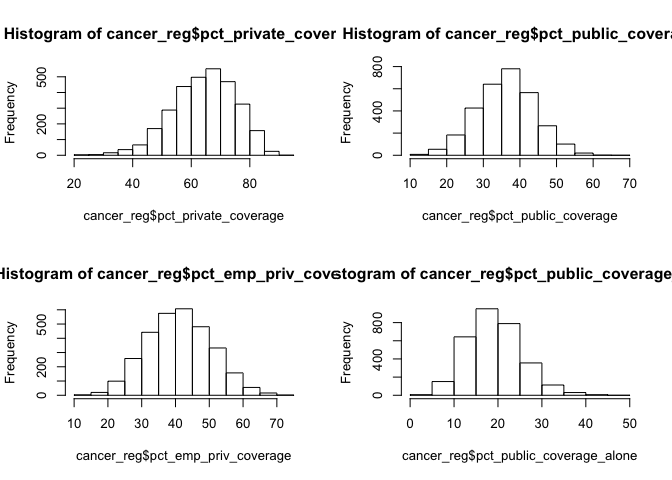

As5697\_tidying\_and\_exploratory
================
Apoorva Srinivasan
12/10/2018

``` r
library(tidyverse)
```

    ## ── Attaching packages ─────────────────────────────────────────────────────────── tidyverse 1.2.1 ──

    ## ✔ ggplot2 3.0.0     ✔ purrr   0.2.5
    ## ✔ tibble  1.4.2     ✔ dplyr   0.7.8
    ## ✔ tidyr   0.8.1     ✔ stringr 1.3.1
    ## ✔ readr   1.1.1     ✔ forcats 0.3.0

    ## ── Conflicts ────────────────────────────────────────────────────────────── tidyverse_conflicts() ──
    ## ✖ dplyr::filter() masks stats::filter()
    ## ✖ dplyr::lag()    masks stats::lag()

### Data loading

``` r
cancer_reg = read_csv("./data/Cancer_Registry.csv") %>%
  janitor::clean_names() %>%
  select(target_death_rate, everything()) %>%
  separate(geography, into = c("county", "state"), sep = ",")
```

    ## Parsed with column specification:
    ## cols(
    ##   .default = col_double(),
    ##   avgDeathsPerYear = col_integer(),
    ##   medIncome = col_integer(),
    ##   popEst2015 = col_integer(),
    ##   binnedInc = col_character(),
    ##   Geography = col_character()
    ## )

    ## See spec(...) for full column specifications.

There are in total 35 variables and 3047observations in the dataset.

Our outcome of interest is **target\_death\_rate**

### dealing with missing data

``` r
#missing data

#colSums(is.na(cancer_reg))

##pct_some_col18_24 has 2285 NAs, pct_employed_coverage_alone has 609 NA, pct_employed16_over has 152 NAs


missing_value = sapply(cancer_reg[1:34], function(x) sum(length(which(is.na(x)))))


# Percentage of missing value
percentage_missing = sapply(cancer_reg[1:34], function(x) sum(length(which(is.na(x)))) / nrow(cancer_reg))
percentage_missing %>% data.frame()
```

    ##                                     .
    ## target_death_rate          0.00000000
    ## avg_ann_count              0.00000000
    ## avg_deaths_per_year        0.00000000
    ## incidence_rate             0.00000000
    ## med_income                 0.00000000
    ## pop_est2015                0.00000000
    ## poverty_percent            0.00000000
    ## study_per_cap              0.00000000
    ## binned_inc                 0.00000000
    ## median_age                 0.00000000
    ## median_age_male            0.00000000
    ## median_age_female          0.00000000
    ## county                     0.00000000
    ## state                      0.00000000
    ## avg_household_size         0.00000000
    ## percent_married            0.00000000
    ## pct_no_hs18_24             0.00000000
    ## pct_hs18_24                0.00000000
    ## pct_some_col18_24          0.74991795
    ## pct_bach_deg18_24          0.00000000
    ## pct_hs25_over              0.00000000
    ## pct_bach_deg25_over        0.00000000
    ## pct_employed16_over        0.04988513
    ## pct_unemployed16_over      0.00000000
    ## pct_private_coverage       0.00000000
    ## pct_private_coverage_alone 0.19986872
    ## pct_emp_priv_coverage      0.00000000
    ## pct_public_coverage        0.00000000
    ## pct_public_coverage_alone  0.00000000
    ## pct_white                  0.00000000
    ## pct_black                  0.00000000
    ## pct_asian                  0.00000000
    ## pct_other_race             0.00000000
    ## pct_married_households     0.00000000

``` r
##getting rid of variables with missing values.

cancer_reg = cancer_reg %>% select(-pct_some_col18_24, -pct_private_coverage_alone, -binned_inc, -median_age) 

  ##removed binned_inc since we already have median income and median age since it is avg of median age female and male. so we'll build model with those those factors instead. ##age+gender


##percentage missing for pct_employed16_over is  ~5%, checking to see if its correlated with the outcome 
reg = lm(target_death_rate~pct_employed16_over, data = cancer_reg) %>%
  summary()

##Since the p-value is small, we will retain pct_employed16_over

cancer_reg = cancer_reg %>% select(-county, -state) %>%
  mutate(mortality = avg_deaths_per_year/pop_est2015, prevalence = avg_ann_count/pop_est2015) %>%
  select(-pop_est2015, -avg_ann_count, -avg_deaths_per_year) %>%
 mutate(study_per_cap =  
        as.factor(ifelse(study_per_cap == 0, "none", 
                         ifelse(study_per_cap < quantile(study_per_cap, .25), "low",
                         ifelse(study_per_cap < quantile(study_per_cap, .5), "medium" ,
                                ifelse(study_per_cap < quantile(study_per_cap, .75), "high", "very high"))))))

  ##Since count itself can be misleading, taking proportion will give us a better model. 
 ##removed state and county variables since we're building a predictive model, area doesn't really matter.
 ##changed study_per_cap to factor variable
```

Now we're left with 28 variables

### exploratory analysis

### coverage

``` r
par(mfrow = c(2,2))
hist(cancer_reg$pct_private_coverage)
hist(cancer_reg$pct_public_coverage)
hist(cancer_reg$pct_emp_priv_coverage)
hist(cancer_reg$pct_public_coverage_alone)
```



``` r
##they are all almost normally distributed
```
