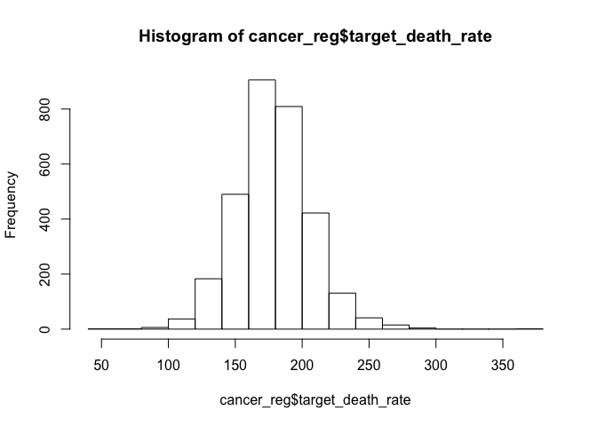
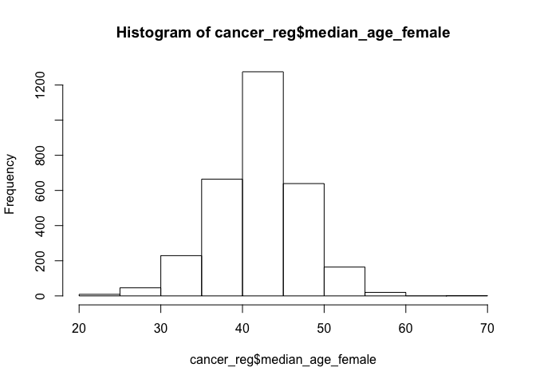
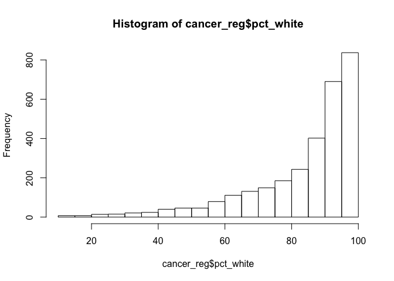

As5697\_tidying\_and\_exploratory
================
Apoorva Srinivasan
12/10/2018

``` r
library(tidyverse)
```

    ## ── Attaching packages ───────────────────────────────────────────── tidyverse 1.2.1 ──

    ## ✔ ggplot2 3.0.0     ✔ purrr   0.2.5
    ## ✔ tibble  1.4.2     ✔ dplyr   0.7.8
    ## ✔ tidyr   0.8.1     ✔ stringr 1.3.1
    ## ✔ readr   1.1.1     ✔ forcats 0.3.0

    ## ── Conflicts ──────────────────────────────────────────────── tidyverse_conflicts() ──
    ## ✖ dplyr::filter() masks stats::filter()
    ## ✖ dplyr::lag()    masks stats::lag()

``` r
library(patchwork)
library("leaps")
library(faraway)
library(caret)
```

    ## Loading required package: lattice

    ## 
    ## Attaching package: 'lattice'

    ## The following object is masked from 'package:faraway':
    ## 
    ##     melanoma

    ## 
    ## Attaching package: 'caret'

    ## The following object is masked from 'package:purrr':
    ## 
    ##     lift

``` r
library(broom)
```

### Data loading

``` r
cancer_reg = read_csv("./data/Cancer_Registry.csv") %>%
  janitor::clean_names() %>%
  select(target_death_rate, everything()) %>%
  separate(geography, into = c("county", "state"), sep = ",")
```

    ## Parsed with column specification:
    ## cols(
    ##   .default = col_double(),
    ##   avgDeathsPerYear = col_integer(),
    ##   medIncome = col_integer(),
    ##   popEst2015 = col_integer(),
    ##   binnedInc = col_character(),
    ##   Geography = col_character()
    ## )

    ## See spec(...) for full column specifications.

There are in total 35 variables and 3047observations in the dataset.

Our outcome of interest is **target\_death\_rate**

### dealing with missing data

``` r
#missing data

#colSums(is.na(cancer_reg))

##pct_some_col18_24 has 2285 NAs, pct_employed_coverage_alone has 609 NA, pct_employed16_over has 152 NAs


missing_value = sapply(cancer_reg[1:34], function(x) sum(length(which(is.na(x)))))


# Percentage of missing value
percentage_missing = sapply(cancer_reg[1:34], function(x) sum(length(which(is.na(x)))) / nrow(cancer_reg))
percentage_missing %>% data.frame()
```

    ##                                     .
    ## target_death_rate          0.00000000
    ## avg_ann_count              0.00000000
    ## avg_deaths_per_year        0.00000000
    ## incidence_rate             0.00000000
    ## med_income                 0.00000000
    ## pop_est2015                0.00000000
    ## poverty_percent            0.00000000
    ## study_per_cap              0.00000000
    ## binned_inc                 0.00000000
    ## median_age                 0.00000000
    ## median_age_male            0.00000000
    ## median_age_female          0.00000000
    ## county                     0.00000000
    ## state                      0.00000000
    ## avg_household_size         0.00000000
    ## percent_married            0.00000000
    ## pct_no_hs18_24             0.00000000
    ## pct_hs18_24                0.00000000
    ## pct_some_col18_24          0.74991795
    ## pct_bach_deg18_24          0.00000000
    ## pct_hs25_over              0.00000000
    ## pct_bach_deg25_over        0.00000000
    ## pct_employed16_over        0.04988513
    ## pct_unemployed16_over      0.00000000
    ## pct_private_coverage       0.00000000
    ## pct_private_coverage_alone 0.19986872
    ## pct_emp_priv_coverage      0.00000000
    ## pct_public_coverage        0.00000000
    ## pct_public_coverage_alone  0.00000000
    ## pct_white                  0.00000000
    ## pct_black                  0.00000000
    ## pct_asian                  0.00000000
    ## pct_other_race             0.00000000
    ## pct_married_households     0.00000000

``` r
##getting rid of variables with missing values.

cancer_reg = cancer_reg %>% select(-pct_some_col18_24, -pct_private_coverage_alone, -binned_inc, -median_age) 

  ##removed binned_inc since we already have median income and median age since it is avg of median age female and male. so we'll build model with those those factors instead. ##age+gender


##percentage missing for pct_employed16_over is  ~5%, checking to see if its correlated with the outcome 
reg = lm(target_death_rate~pct_employed16_over, data = cancer_reg) %>%
  summary()

##Since the p-value is small, we will retain pct_employed16_over

cancer_reg = cancer_reg %>% select(-county, -state) %>%
  mutate(mortality = avg_deaths_per_year/pop_est2015, prevalence = avg_ann_count/pop_est2015) %>%
  select(-pop_est2015, -avg_ann_count, -avg_deaths_per_year) %>%
 mutate(study_per_cap =  
        as.factor(ifelse(study_per_cap == 0, "none", 
                         ifelse(study_per_cap < quantile(study_per_cap, .25), "low",
                         ifelse(study_per_cap < quantile(study_per_cap, .5), "medium" ,
                                ifelse(study_per_cap < quantile(study_per_cap, .75), "high", "very high")))))) %>%
  mutate(pct_non_white = pct_black+ pct_asian + pct_other_race) %>%
  select(-pct_black, -pct_asian, -pct_other_race) ##since the number of whites are a lot higher, putting the other minorities under a single variable.

  ##Since count itself can be misleading, taking proportion will give us a better model. 
 ##removed state and county variables since we're building a predictive model, area doesn't really matter.
 ##changed study_per_cap to factor variable
```

Now we're left with 26 variables

### exploratory analysis

``` r
hist(cancer_reg$target_death_rate) #outcome is normally distributed
```



``` r
hist(cancer_reg$pct_private_coverage)
```


``` r
hist(cancer_reg$pct_public_coverage)
```


``` r
hist(cancer_reg$pct_emp_priv_coverage)
```


``` r
hist(cancer_reg$pct_public_coverage_alone)
```


``` r
hist(cancer_reg$incidence_rate) ##right skewed
```


``` r
hist(cancer_reg$med_income) #somewhat right skewed-mostly ok
```


``` r
hist(cancer_reg$poverty_percent)
```


``` r
hist(cancer_reg$median_age_male)
```


``` r
hist(cancer_reg$median_age_female)
```



``` r
hist(cancer_reg$avg_household_size) ##left skewed
```


``` r
hist(cancer_reg$percent_married)
```


``` r
hist(cancer_reg$pct_no_hs18_24) #somehwat right
```


``` r
hist(cancer_reg$pct_hs18_24)
```


``` r
hist(cancer_reg$pct_bach_deg18_24)#right skewed
```


``` r
hist(cancer_reg$pct_hs25_over)
```


``` r
hist(cancer_reg$pct_bach_deg25_over)
```


``` r
hist(cancer_reg$pct_employed16_over)
```


``` r
hist(cancer_reg$pct_unemployed16_over)
```


``` r
hist(cancer_reg$pct_white) #left  skewed
```



``` r
hist(cancer_reg$pct_non_white) #right skewed
```


``` r
hist(cancer_reg$pct_married_households)
```


``` r
hist(cancer_reg$birth_rate)
```


``` r
hist(cancer_reg$mortality)
```


``` r
hist(cancer_reg$prevalence) #right skewed
```


``` r
##they are all almost normally distributed
```

### descriptive statistics: cont variable

``` r
cont_var = dplyr::select(cancer_reg, target_death_rate, everything(), -c(study_per_cap))
knitr::kable(summary(cont_var), caption = "descriptive statistics for continuous variables")
```

|     | target\_death\_rate | incidence\_rate |   med\_income  | poverty\_percent | median\_age\_male | median\_age\_female | avg\_household\_size | percent\_married | pct\_no\_hs18\_24 | pct\_hs18\_24 | pct\_bach\_deg18\_24 | pct\_hs25\_over | pct\_bach\_deg25\_over | pct\_employed16\_over | pct\_unemployed16\_over | pct\_private\_coverage | pct\_emp\_priv\_coverage | pct\_public\_coverage | pct\_public\_coverage\_alone |   pct\_white   | pct\_married\_households |   birth\_rate  |     mortality    |     prevalence    | pct\_non\_white |
|-----|:--------------------|:----------------|:--------------:|:-----------------|:------------------|:--------------------|:---------------------|:-----------------|:------------------|:-------------:|:---------------------|:----------------|:-----------------------|:----------------------|:------------------------|:-----------------------|:-------------------------|:----------------------|:-----------------------------|:--------------:|:-------------------------|:--------------:|:----------------:|:-----------------:|:----------------|
|     | Min. : 59.7         | Min. : 201.3    |  Min. : 22640  | Min. : 3.20      | Min. :22.40       | Min. :22.30         | Min. :0.0221         | Min. :23.10      | Min. : 0.00       |   Min. : 0.0  | Min. : 0.000         | Min. : 7.50     | Min. : 2.50            | Min. :17.60           | Min. : 0.400            | Min. :22.30            | Min. :13.5               | Min. :11.20           | Min. : 2.60                  |  Min. : 10.20  | Min. :22.99              |  Min. : 0.000  |  Min. :0.000485  |  Min. :0.0009281  | Min. : 0.000    |
|     | 1st Qu.:161.2       | 1st Qu.: 420.3  | 1st Qu.: 38882 | 1st Qu.:12.15    | 1st Qu.:36.35     | 1st Qu.:39.10       | 1st Qu.:2.3700       | 1st Qu.:47.75    | 1st Qu.:12.80     |  1st Qu.:29.2 | 1st Qu.: 3.100       | 1st Qu.:30.40   | 1st Qu.: 9.40          | 1st Qu.:48.60         | 1st Qu.: 5.500          | 1st Qu.:57.20          | 1st Qu.:34.5             | 1st Qu.:30.90         | 1st Qu.:14.85                | 1st Qu.: 77.30 | 1st Qu.:47.76            | 1st Qu.: 4.521 | 1st Qu.:0.001888 | 1st Qu.:0.0048022 | 1st Qu.: 1.964  |
|     | Median :178.1       | Median : 453.5  | Median : 45207 | Median :15.90    | Median :39.60     | Median :42.40       | Median :2.5000       | Median :52.40    | Median :17.10     |  Median :34.7 | Median : 5.400       | Median :35.30   | Median :12.30          | Median :54.50         | Median : 7.600          | Median :65.10          | Median :41.1             | Median :36.30         | Median :18.80                | Median : 90.06 | Median :51.67            | Median : 5.381 | Median :0.002290 | Median :0.0056236 | Median : 5.569  |
|     | Mean :178.7         | Mean : 448.3    |  Mean : 47063  | Mean :16.88      | Mean :39.57       | Mean :42.15         | Mean :2.4797         | Mean :51.77      | Mean :18.22       |   Mean :35.0  | Mean : 6.158         | Mean :34.80     | Mean :13.28            | Mean :54.15           | Mean : 7.852            | Mean :64.35            | Mean :41.2               | Mean :36.25           | Mean :19.24                  |  Mean : 83.65  | Mean :51.24              |  Mean : 5.640  |  Mean :0.002287  |  Mean :0.0232443  | Mean :12.345    |
|     | 3rd Qu.:195.2       | 3rd Qu.: 480.9  | 3rd Qu.: 52492 | 3rd Qu.:20.40    | 3rd Qu.:42.50     | 3rd Qu.:45.30       | 3rd Qu.:2.6300       | 3rd Qu.:56.40    | 3rd Qu.:22.70     |  3rd Qu.:40.7 | 3rd Qu.: 8.200       | 3rd Qu.:39.65   | 3rd Qu.:16.10          | 3rd Qu.:60.30         | 3rd Qu.: 9.700          | 3rd Qu.:72.10          | 3rd Qu.:47.7             | 3rd Qu.:41.55         | 3rd Qu.:23.10                | 3rd Qu.: 95.45 | 3rd Qu.:55.40            | 3rd Qu.: 6.494 | 3rd Qu.:0.002681 | 3rd Qu.:0.0064874 | 3rd Qu.:16.974  |
|     | Max. :362.8         | Max. :1206.9    |  Max. :125635  | Max. :47.40      | Max. :64.70       | Max. :65.70         | Max. :3.9700         | Max. :72.50      | Max. :64.10       |   Max. :72.5  | Max. :51.800         | Max. :54.80     | Max. :42.20            | Max. :80.10           | Max. :29.400            | Max. :92.30            | Max. :70.7               | Max. :65.10           | Max. :46.60                  |  Max. :100.00  | Max. :78.08              |  Max. :21.326  |  Max. :0.005136  |  Max. :2.3675123  | Max. :86.066    |
|     | NA                  | NA              |       NA       | NA               | NA                | NA                  | NA                   | NA               | NA                |       NA      | NA                   | NA              | NA                     | NA's :152             | NA                      | NA                     | NA                       | NA                    | NA                           |       NA       | NA                       |       NA       |        NA        |         NA        | NA              |

descriptive stat: cat variable
------------------------------

``` r
cancer_reg %>%
group_by(study_per_cap) %>%
count() %>%
ungroup() %>%
mutate(prop = n / sum(n)) %>%
knitr::kable(digits = 2, caption = "Descriptive Statistics for clinical trial")
```

| study\_per\_cap |     n|  prop|
|:----------------|-----:|-----:|
| high            |   354|  0.12|
| none            |  1931|  0.63|
| very high       |   762|  0.25|

Choose varibles from coverage, education, employment based on best fit.

### coverage

``` r
multi.fit = lm(target_death_rate ~ ., data = cancer_reg)
summary(multi.fit)
```

    ## 
    ## Call:
    ## lm(formula = target_death_rate ~ ., data = cancer_reg)
    ## 
    ## Residuals:
    ##     Min      1Q  Median      3Q     Max 
    ## -82.182  -7.532   0.058   7.141  84.257 
    ## 
    ## Coefficients:
    ##                             Estimate Std. Error t value Pr(>|t|)    
    ## (Intercept)                2.032e+02  1.058e+01  19.206  < 2e-16 ***
    ## incidence_rate             8.692e-02  5.297e-03  16.410  < 2e-16 ***
    ## med_income                 2.619e-04  5.343e-05   4.902 1.00e-06 ***
    ## poverty_percent           -3.129e-03  1.075e-01  -0.029 0.976775    
    ## study_per_capnone         -9.543e-01  8.107e-01  -1.177 0.239270    
    ## study_per_capvery high    -1.389e+00  8.532e-01  -1.628 0.103542    
    ## median_age_male           -6.012e-01  1.410e-01  -4.263 2.08e-05 ***
    ## median_age_female         -2.264e+00  1.499e-01 -15.100  < 2e-16 ***
    ## avg_household_size        -1.197e-02  6.501e-01  -0.018 0.985307    
    ## percent_married            1.174e-02  1.177e-01   0.100 0.920606    
    ## pct_no_hs18_24            -1.113e-03  3.771e-02  -0.030 0.976454    
    ## pct_hs18_24                2.967e-01  3.324e-02   8.927  < 2e-16 ***
    ## pct_bach_deg18_24          3.625e-02  7.233e-02   0.501 0.616350    
    ## pct_hs25_over              8.539e-02  6.429e-02   1.328 0.184219    
    ## pct_bach_deg25_over       -3.547e-01  1.052e-01  -3.373 0.000753 ***
    ## pct_employed16_over       -6.641e-01  7.320e-02  -9.072  < 2e-16 ***
    ## pct_unemployed16_over      7.958e-01  1.121e-01   7.099 1.58e-12 ***
    ## pct_private_coverage      -2.716e-01  8.736e-02  -3.109 0.001896 ** 
    ## pct_emp_priv_coverage      4.285e-01  7.042e-02   6.085 1.32e-09 ***
    ## pct_public_coverage       -1.964e+00  1.544e-01 -12.720  < 2e-16 ***
    ## pct_public_coverage_alone  1.802e+00  1.904e-01   9.464  < 2e-16 ***
    ## pct_white                 -1.341e-01  3.874e-02  -3.460 0.000548 ***
    ## pct_married_households     5.822e-02  1.134e-01   0.513 0.607691    
    ## birth_rate                -5.153e-01  1.292e-01  -3.989 6.81e-05 ***
    ## mortality                  4.949e+04  7.916e+02  62.524  < 2e-16 ***
    ## prevalence                -1.699e+01  2.422e+00  -7.013 2.89e-12 ***
    ## pct_non_white             -4.812e-02  3.746e-02  -1.284 0.199120    
    ## ---
    ## Signif. codes:  0 '***' 0.001 '**' 0.01 '*' 0.05 '.' 0.1 ' ' 1
    ## 
    ## Residual standard error: 12.71 on 2868 degrees of freedom
    ##   (152 observations deleted due to missingness)
    ## Multiple R-squared:  0.7877, Adjusted R-squared:  0.7857 
    ## F-statistic: 409.2 on 26 and 2868 DF,  p-value: < 2.2e-16

``` r
reg1 = lm(target_death_rate~pct_private_coverage, data = cancer_reg) %>%
  summary()
reg2 = lm(target_death_rate~pct_emp_priv_coverage, data = cancer_reg) %>%
  summary()
reg3 = lm(target_death_rate~pct_public_coverage, data = cancer_reg) %>%
  summary()
reg4 = lm(target_death_rate~pct_public_coverage_alone , data = cancer_reg) %>%
  summary()

##I'd pick public_coverage alone since it has max r^2

plot(cancer_reg$pct_private_coverage, cancer_reg$target_death_rate)
abline(reg1,lwd = 2,col = 2)
```

    ## Warning in abline(reg1, lwd = 2, col = 2): only using the first two of 8
    ## regression coefficients


``` r
plot(cancer_reg$pct_emp_priv_coverage, cancer_reg$target_death_rate)
abline(reg2,lwd = 2,col = 2)
```

    ## Warning in abline(reg2, lwd = 2, col = 2): only using the first two of 8
    ## regression coefficients


``` r
plot(cancer_reg$pct_public_coverage, cancer_reg$target_death_rate)
abline(reg3,lwd = 2,col = 2)
```

    ## Warning in abline(reg3, lwd = 2, col = 2): only using the first two of 8
    ## regression coefficients


``` r
plot(cancer_reg$pct_public_coverage_alone, cancer_reg$target_death_rate)
abline(reg4,lwd = 2,col = 2)
```

    ## Warning in abline(reg4, lwd = 2, col = 2): only using the first two of 8
    ## regression coefficients


